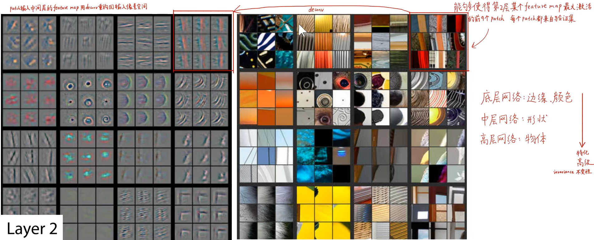
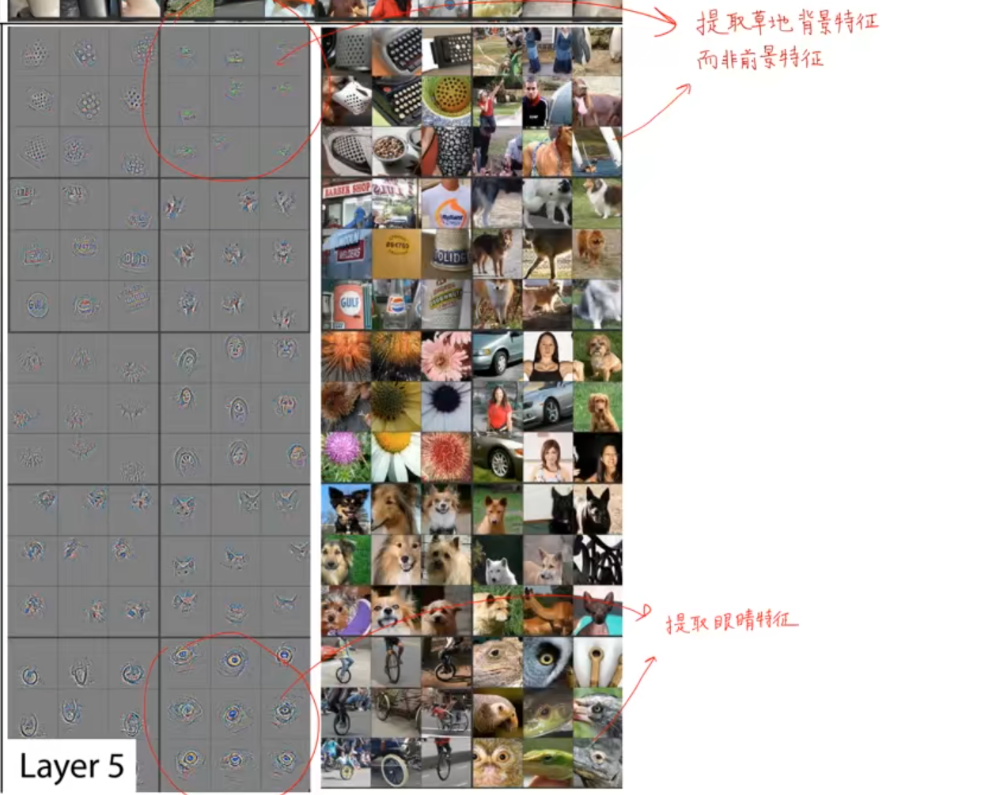
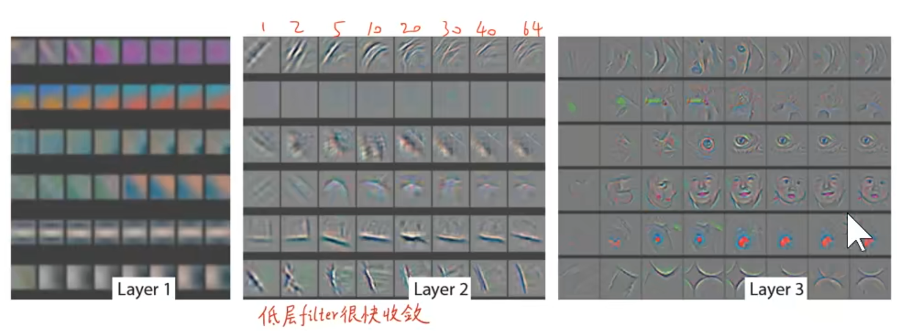
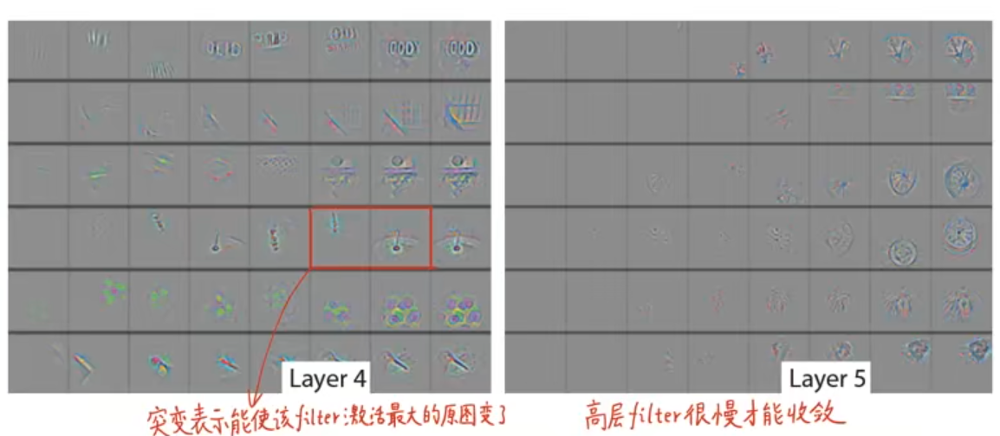
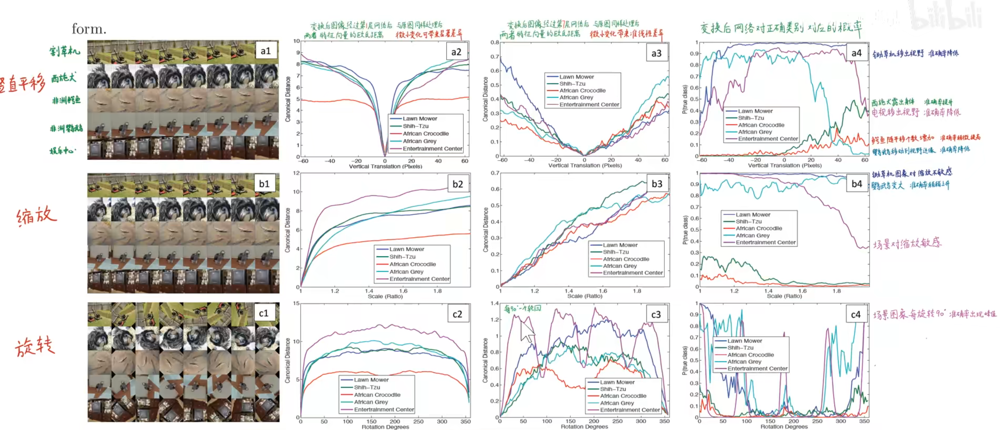
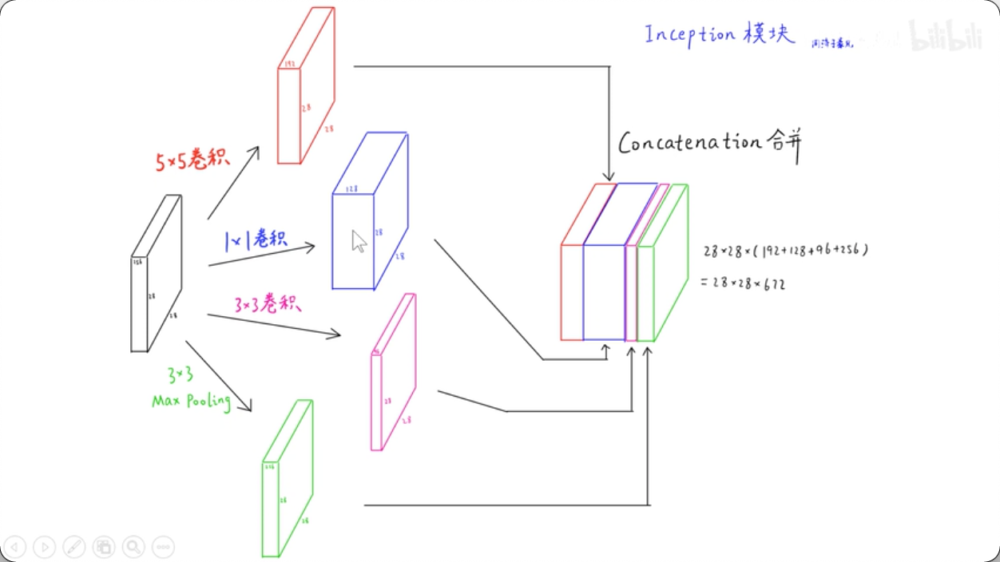
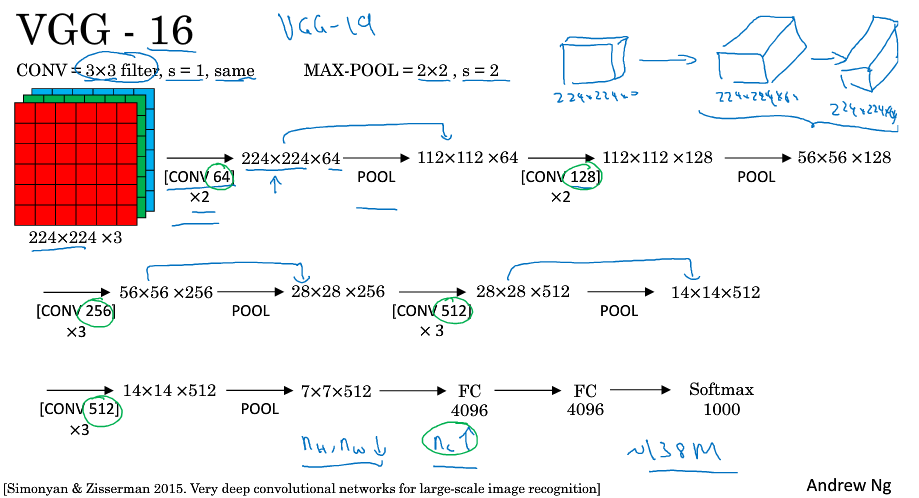

计算机视觉解决的问题：
- 分类
    - 定位
- 检测，对定位进行分分析
- 分割，对像素进行分析
    - 语义分割，Semantic Segmentation
    - 实体分割, Instance Segmentation

# AlexNet

- CNN卷积神经网络
- ReLU
- 双GPU模型并行
- LRN局部响应归一化
- 重叠最大池大
- 数据增加（随机翻转，裁切，颜色转换(PCA)等）
- Dropout

要点：
- 短边下采样到256x256再裁剪
    - 256x256再选择224x224，这样就有32种可能性
    - 大大扩充了样本量
- 8=5+3（卷积+全连接）个学习权重的层
- 对每张图像提取出5张（四个角落以及中间）以及水平镜像版本，总共10张，平均10个预测作为最终预测。

超参：
SGD，学习率0.01，batch size是128，momentum为0.9，weight decay为0.0005（论文有个权重更新公式），每当validation error不再下降时，学习率除以10。权重初始化用（0，0.01）的高斯分布，二四五卷积层和全连接层的bias初始化为1（给relu提供正值利于加速前期训练），其余bias初始化为0。

# ZFNet

Visualizing and Understanding Convolutional Networks

先找到对某个卷积核激活最大化的原图块，再应用（反？）卷积，把它可视化出来，就能知道这个卷积核提取的是什么特征，有个[类似的项目](https://distill.pub/2017/feature-visualization/)

就一些讲解来看，确实不是用原图卷积得到特征图，而是把原图放到特征图的位置，应用反激活，反池化，反卷积，得到的结果。

可以看到，截图显示的layer2提取的特征已经很明显了，基本上就是条纹。

到了第5层，可以看到能找出的原图已经不像前几层那么“几乎一样”了，说明它提取的特征已经很高级了，比如圈出来的几项，有的提取了草地，有的提取了眼睛，而不管图片是不是从像素的颜色分布是不是基本一致了。

1. 横向表示不同的特征，纵向表示训练的轮数
2. 高级特征显然要很多轮次才能收敛
3. 突变能使fiter激活最大的原图变了

对图片的处理（平移，缩放，旋转）影响特征的提取：

1. 特征越高级，影响越小
2. 旋转的影响有周期性（第3列图）

通过可视化发现第一层的卷积核影响大，于是对第一层的卷积核做了规范化，如果RMS（Root Mean Square）超过0.1，就把卷积核的均方根normalize为固定0.1。

# GoogLeNet

22层，加上pooling有27层。9个Inception模块堆叠

几个平行卷积成相同大小但不同厚度的张量（5x5, 1x1, 3x3, 3x3pool)->(192, 128, 96, 256)，叠起来，叫一个Inception模块，传到下一层   
同时考虑了用1x1的卷积来降维（降厚度），以及GAP（全局平均池化），每个通道只保留一个数字（平均值），这样变成了一维向量，个数就是通道数（很多Net里面用它来取代全连接层，或flatten层）

- AlexNet中上一层所有通道一起参与卷积，实现更好的并行运算和加速， 
- LeNet-5中将上一层部分通道组合后传入下一层
- 将稀疏矩阵分解为密集的子矩阵，能加速矩阵乘法

# Inception V2, V3

把Inception块里面的5x5卷积变成3x3卷积再接一个3x3卷积，这样，一个5x5输出为1, 5x5被3卷积后是3x3，再3卷积1次，也就变成1x1了，这样是为了减少计算量

同时还将3x3变成3x1加1x3（横向），7x7变成1x7,7x1（纵向）等等

# VGG

该网络的特点在于结构规整，通过反复堆叠3x3的卷积，卷积核数量逐渐加倍来加深网络，后续的很多CNN结构都采用了这种3x3卷积思想，这是一个很大的影响。

ZFNet和OverFeat都使用了更小的卷积核，更小的步长来提升AlexNet的表现，相比之下，VGG则是探索CNN的深度，通过固定其它参数，然后稳定地叠加深度。

# ResNet

[CNN经典结构](https://www.cnblogs.com/liaohuiqiang/p/9606901.html)

[CNN经典结构2](https://www.cnblogs.com/liaohuiqiang/p/9691458.html)