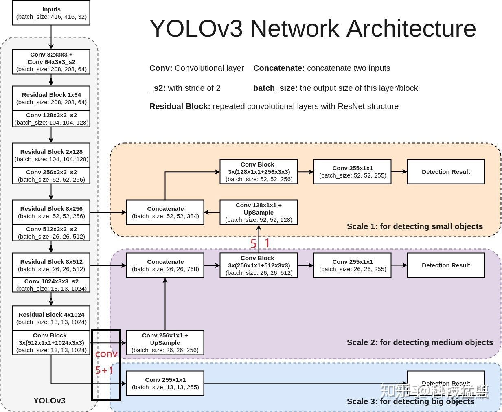

# Yolo

dla网络(Deep Layer Aggregation)
残差，何凯明
Mish, leak-relu
FPN(何凯明）->一次上采样后和N步前的合并，再走几步后再上采样，再跟更前的合并 （就是为了融合高抽象和低抽象的特征）

v4的p5, p6, p7讲的就是级别（即不同尺度的抽象）
608->(76, 38, 19) 即8倍，16倍，32倍
相比而言，pnet是2倍（12,  24, 48)

Focus先切片（不是整图切，而是比如每田字形四个像素，分别四次来取，这样的话就切成了4份，即都是每隔几个像素取一个来的）——> 无损下采样，（增加了通道）

网络训练的尺寸其实不是固定的，因为网络下采样5次，2的五次方等于32，因此网络的输入尺寸只需要是32的倍数，能保证下采样缩小5次即可。

---

Yolo把图像分割成nxn份，每一份给几个预设框，用预设框与真值去对比，找出最接近的
Yolo的预设框都是为特定数据集用kmeans聚类出来的
所以yolo是从锚框出发，找参数与真值拟合，得到的模型参数也是针对锚框的
=> generating candidate anchor boxes from bounding box data

 single shot detection (SSD)，每个cell有9个预设好的框，而yolo是聚类出来的，就这点差别吧？

越多的锚框会产生越高的真值重合度，但会带来更多的计算量

The appropriate bounding box is selected as the bounding box with highest IOU between the ground truth box and anchor box.

这样产生的框和真值中心重合度也是很高的

----

我感觉yolo的核心就是”**直接猜答案**“

即如果你想要的是包含了检测对象的框，我不去分析怎么检测，而是直接把答案的形式告诉我，然后我根据这个形式去填数字，填到与真值差不多为止
即我想要的是四个坐标，那我就海天海地乱猜，猜到这四个坐标为止，根本别问我逻辑！
以上， yolo v0

其实与滑窗的区别就是，滑窗的每个窗口，你都要进行一次从头到尾的卷积，每一次都有一个head, 如果你有5x5次滑窗，就有25个head
而Yolo只有一个从头到尾的卷积，即只有一个head

进行修正的话，就是先用答案找出几个些许好的预设框，然后在这些预设框上为基础开始瞎猜
猜的最准的，就把参数记下。（这就是我前面说的，用预设框与真值来拟合）

对不同位置不同目标的修正，那就是划格子了，

* V1: 预测位置  （预测目标少）
* V2: 预测相对预设anchor的偏移量 （引入了5个anchor，但小目标仍然效果不好）
* V3: 何凯明的残差网络让网络可以更深

x, y基于grid坐标， w, h基于anchor box



这是我见过最好懂的结构图，可以看出，只有13x13的是直接出结果的，  
13x13上采样后与前面流程的26x26反向结合，再出另一个头
26x26的上采样成52x52的与更前面流程的反向结合，出最大的一个头

generation | BackBone | Neck  |  Head | Prediction | Remark
-----------|----------|-------|-------|------------|-------
YoloV1 | GoogleNet | None | MSE | Fc -> 7 * 7 * 30 | ?
YoloV2 | darknet19 | None | MSE |  Conv -> 13 * 13 * 5 * (5+20) | 5个框，20个类别
YoloV3 | darknet53, CSP | None | MSE |  Conv -> 13 * 13 * 5 * (5+80) | 5个框（不是3x3=9个框？）80个类别，13，26， 52融合
YoloV4 | darknet53, CSP | SPP, FPN+PAN | DIoU | V3
YoloV5 | darknet53, Focus,CSP | SPP, CSP, FPN+PAN | GIoU | V3

## V3


将图片划分成3x3的区域，每个区域生成一个8维的向量（假定3个类别），分别表示是否有目标，位置，和类别  
这样你就可以构造如图的神经网络，输入是150\*150\*3，输出是3\*3\*8


如果有多个物体，那么就增加维度，即使两个物体的中心点可能在同一个cell内，  
现在你的任务变成了构造一个输出是3 * 3 * 16的网络了


多尺度融合，通过不同的感受野，达到检测不同大小目标的目的


53层的由来

如果仅仅用来目标分类，那这样就行了：


但还要目标定位的话，我们将其中的池化层，全连接层，softmax层全砍掉，接上上面说的三个尺度的特征图，就完成了既分类又定位的任务了：
.png)

这里再复习一下FPN，前面说过了是上采样再反向与前面的特征图进行连接：

不管怎么画，意思应该都表达清楚了

测试过程：

其中，打分为是否有目标和类别的乘积（所以是否有目标难道不是非0即1？），然后还要对同一目标进行一次NMS 

## V4


> 几个月后我再来看这个图, 就是三个维度来来回回捣腾，  
> 我们用A,B,C表示不同的阶段   
> 用up, down表示上采样，下采样  
> 尝试讲解一下过程：  
1. 52_A $\rarr$ 26_A $\rarr$ 13_A
2. 13_A_up + 26_A $\rarr$ 26_B
3. 26_B_up + 52_A $\rarr$ 52_B $\rarr$ output: 52 * 52 * 255
4. 52_B_down + 26_B $\rarr$ 26_C $\rarr$ output: 26 * 26 * 255
5. 26_C_down + 13_A $\rarr$ 13_B $\rarr$ output: 13 * 13 * 255

当然，再看到后面，其实总结了，就是`FPN`+`PAN`
* 上采样跟前面的拼接是`FPN`
* 下采样跟前面的拼接是`PAN`
* 拼到一起就是V4干的事（V3在FPN后就接输出了）

复习: 255 = (1 + 4 + 80) * 3, 即1个判断，4个坐标，80个类别，3个锚框

改进：

### CSP

csp模块的优点：
* 增强CNN学习能力
* 降低计算瓶颈
* 降低内存成本

### Dropblock

Dropblock的优点：
* 效果优于Cutout
* 可应用于网络的每一层
* 没组合，更加灵活

### SPP


分别用1x1, 5x5, 9x9, 13x13四种池化方式，拼接后由13x13x512变成了13x13x2048

### PAN

加入了PAN结构

上面反复说了FPN是怎么回事，即在52，26，的位置分别等着，13完了后，再上采样回26，连接输出，再上采样到52，连接输出   
而PAN结构反了过来：

1. 26，52，与上面一样，等着
2. 到了13*13后，也等着（v3里面已经直接输出head了）
3. 上采样成26，与等着的26拼接
4. 这里行成了26继续等着
5. 继续上采样，成52，拼接，输出成head
6. 再下采样成26，与上一步新的等着的26拼接，输出成26的head
7. 继续下采样成13，与新的等着的13拼接成13的head

换个图：

意思是一样的

### loss

损失函数的进化：

* GIoU考虑了两个框不相交
* DIoU考虑了一个框完全在另一个里面
* CIoU考虑了完全在另一个框里面，中心点也相同，但框形状不同

V4采用的是DIoU_nms，因为CIoU需要真值参与，但预测和推理过程是没有真值的

## V5


### auto anchor

Coco数据集设定的锚框
```yaml
anchors:
    - [116,90, 156,198, 373,326]    # P5/32
    - [30,61, 62,45, 59,119]        # P4/16
    - [10,13, 16,30, 33,23]         # P3/8
```
在Yolov3、Yolov4中，训练不同的数据集时，计算初始锚框的值是通过单独的程序运行的。

但Yolov5中将此功能嵌入到代码中，每次训练时，自适应的计算不同训练集中的最佳锚框值。

如果要关闭：
```python
parser.add.argument('--noautoanchor', action='store true', help='disable autoanchor check')
```

### Focus


隔一个取一个，必然导致边长减半，层数X4（横向2份，纵向2份）  
608 * 608 * 3 -> 304 * 304 * 12

### 网络大小

四个网络大小(s,m,l,x)只有`depth_multiple`和`width_multiple`不同， 瓶有分别读到`gd, gw`两个变量里：

```python
anchors, nc, gd, gw = d['anchors'], d['nc'], d['deptch_multiple'], d['width_multiple']
```

```yaml
# 5s
depth_multiple: 0.33  # model depth multiple
width_multiple: 0.50  # layer channel multiple
# 5m
depth_multiple: 0.67  # model depth multiple
width_multiple: 0.75  # layer channel multiple
# 5l
depth_multiple: 1.0   # model depth multiple
width_multiple: 1.0   # layer channel multiple
# 5x
depth_multiple: 1.33  # model depth multiple
width_multiple: 1.25  # layer channel multiple

```

深度影响csp模块中残差块(backbone中）或卷积块(neck中）的个数，宽度影响backbone中卷积核的宽度

### CSP

比v4多了一个csp，一个用在backbone（带残差），共3个，一个用在neck（不带残差）共4个


CSP1_1表示是backbone中的CSP，并且只带一个残差块，在不同的网络大小中，CSP1_X中的X取值不同

CSP2_1则代表neck中的CSP块中CBL块的个数，计算方法相同：

* gd：来自depth_multiple
* n: 来自

红框部分的第2个参数，如3，9，9，并且：  
`n = max(round(n * gd), 1) if n > 1 else n  # depth gain`
* 计算：
>
5s中， depth=0.33,  
n = max(round(3 * 0.33), 1) = 1  
=> CSP1_1
n = nax(round(9 * 0.33), 1) = 3
=> CSP1_3

5l中， depth=1
分别为3 * 1, 9 * 1 => CSP1_3, CSP1_9, 与图中都对得上   
但要知道这代表的是残差块的个数

同样的计算应用在`CSP2`上，只不过代表的是卷积层的个数罢了

#### 宽度

宽度决定的是backbone中卷积核的数量（channel)


所以经过多少个卷积核，就产生多少输出(output channel)  
5s中`Focus`有32个卷积核，那么输出应该为：
> 608 x 608 x 3 -> 304 x 304 x 12 -> 304 x 304 x 32  
接下来是64个，自然就是 -> 152 x 152 * 64了

控制宽度的代码在`yolo.py`：
```python
c2 = make_divisible(c2 * gw, 8) if c2 != no else c2

def make_divisible(x, divisor):
    # Returns X evenly divisble by divisor
    return math.ceil(x / divisor) * divisor
```
`c2`在`yaml`配置文件中的从这里读：

这里给的是5l的例子

计算：
>以5l的Focus为例：  
width_multiple = gw = 1  
因为它是1，所以与c2总是相等的，即64，且接下来的卷积层是128

