# Static and Dynamic Arrays

**static array**
* fixed length
* indexable

usage:
* sequential data
* IO routines as buffers
* lookup tables and inverse lookup tables
* return multiple values

operation complexity:
access: O(1)
search: `O(n)`
insert: `O(n)`
append: O(1)
delet: `O(n)`
需要遍历的操作就是O(n)

Q: How to implement a dynamic array?
A:
1. static array with an initial capacity
2. add new elements, keep tracking the size
3. if exceed capacity, create a new static array with `twice the capacity`
    * and copy the original elements into it

## Singly and Doubly Linked Lists

单向/双向链表

sequential list of nodes that hold data which point to other nodes also containing data. 
* 节点序列，
* 节点拥有指向别的节点的数据（指针）
* 别的节点也拥有这种指针

usage:
* many `List, Queue & Stack` implementations
* circular lists
* model real world objects such as `trains`
* implementation of adjancy list for graphs
* separate chaining -> ?
    * deal with hashing collisions -> ?

Terminology:
Head / Tail / Pointer / Node

Singly vs Doubly
* Doubly holds a `next` and `prev` reference, which Singly has no `prev`
    * 插入删除的时候需要更新所有引用
* both maintain a reference of `head` and `tail` for quick additions / removals

insertion:
* create a traverser and move by sepcific steps
* create new node
* singly:
    * 原node的next指向新node
    * 新node的next指向原next的node
* doubly:
    * 新node的next和prev分别指向原node和下一个node
    * 两个node分别用next和prev指向新node

removal：

singly需要两个游标:
* pt1指向head, pt2指向head->next
* pt1, pt2一起移动，直到pt2找到目标
* pt2再向前移动一步
* pt1位置的node用next指向pt2位置
* now can sefely remoing the element between pt1 and pt2

doubly却只需要一个：
* pointer找到目标元素
* 用prev和next找到上一个和下一个
* 下一个和下一个node分别互相指向

**Complexity**
searth: `O(n)`
insert at head/tail: O(1)
remove at head: O(1)
remove at tail: `O(n)` (singly) / O(1) (doubly)
    * 因为即使我们知道tail在哪，在单向链表中，我们也找不到它的前一个去设置为新的tail
remove in middle: `O(n)`

# Stack

* one-ended linear data structure (LIFO)
* two operation: `push` and `pop`

**Usage**
* undo mechanisms
* compiler syntax checking for matching brackets and braces
    * 开括号压入栈内，每碰到一个闭括号，与栈顶的比较，匹配就出栈，不匹配就报错
* model a pile of books or plates
    * 汉诺塔(tower of hanoi)
* tracking previous function calls
* DFS on a graph

**Complexity**
push/pop/peek/size: O(1)
search: `O(n)`

双向链表实现一个Stack，基本上就是操作tail

# Queues

* a linear data structure, model real world queues (FIFO)
* two primary operations: `enqueue`, `dequeue`

**Usage**

* any waiting line models a queue
* keep track of the x most recently added elements -> ?
* web server request management where you want first come first serve
* BFS graph traversal

**Complexity**

只有`contains, revomval`需要遍历，其它操作（出入列等）都是O(1)

实现一个BFS：

广度优先，每个节点访问尽可能多的邻居，所以把所有neighbour加到队列里，再一个个访问，从队列里按添加先后取出节点（所以最先加的节点会最先取出来，取出来干的事是找neighbour，这就实现了广度优先）
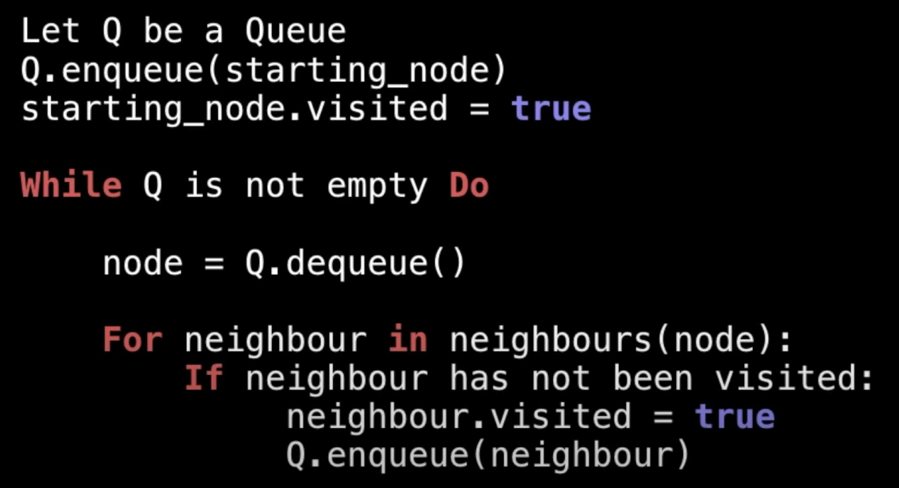

双向列表实现Queue，入列用tail，出列用head，即添加的总在尾巴，永远从头部取出。

# Priority Queues (PQs) with an interlude on heaps

* A priority queue is an `Abstract Data Type` (ADT)
* except each element has a certain priority
    * determine the order (removed from the PQ)
* need `comparable data`

每次取出最小（或最大）的->pool，添加到PQ，如何得知极值呢？-> heap

## Heap

* a tree based data structure
* statisfies the `heap invariant`(heap property):
    * if A is a parent node of B then A is `ordered with respect ot B` for all nodes A, B in the heap
    * 说人话，A是B的父节点，如果A比B大，那么比B的所有子节点都大，vice versa

Priority Queue有时候也被叫做Heap，因为它只是一个ADT，当然它也可以用别的数据结构实现。

以下四个，都是heap
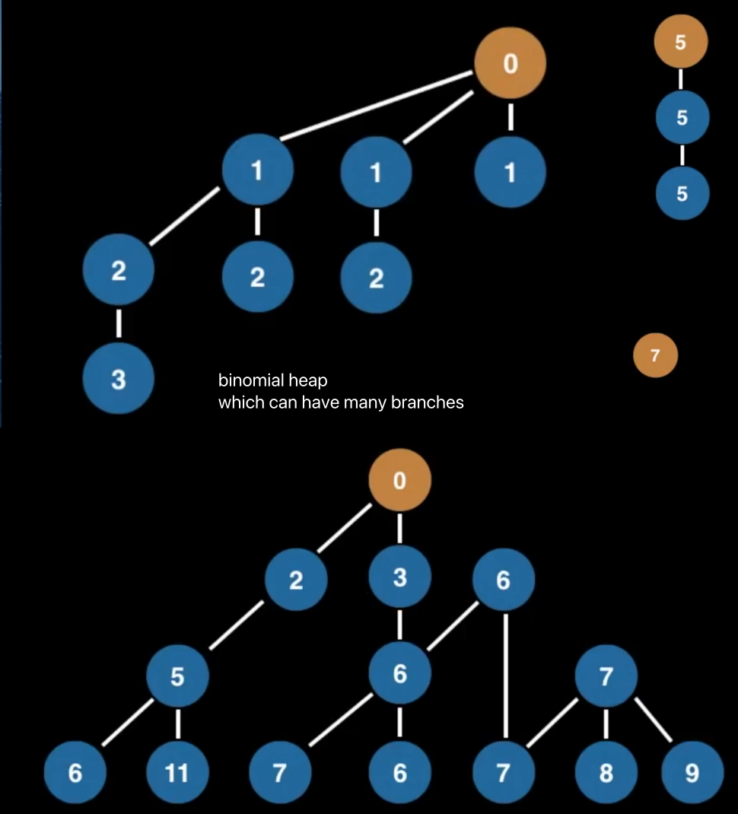
这些就不是
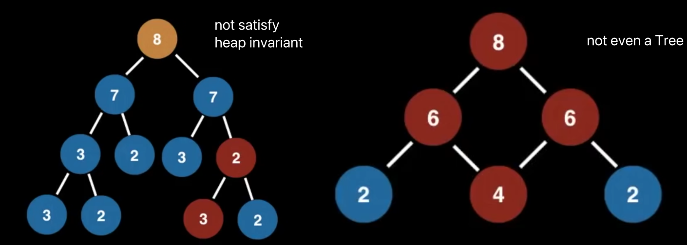

**Usage**

* certain implementations of `Dijkstra's Shortest Path algorithm`
* anytime you need the *dynamically* fetch the **next** `best` or `worst` element
* `Huffman coding` -> lossless data compression
* BFS，PQs `continuously grab the next` most promising node
* `Minimum Spaning Tree` (MST) algorithm

可见是很多算法的基础

**Complexity**

- Binary Heap construction: O(n)
- Polling: O(log n)
- Peeking: O(1)
- Adding: O(log n)
- 原生删除：O(n)
    - with hash table: O(log n)
- 原生contains: O(n)
    - with hash table: O(1)


**Turning Min PQ into Max PQ**

大多数编程语言标准库只提供了min PQ。

1. 在构建min pq的时候，把比较标准从`x>=y`变成`x<=y`（operator重载）
2. 在构建min pq的时候，把x变成`-x`，取出的时候再取反一次 

原则都是取巧，而且，第二种方法，存在pq里的，并不是你要使用（和本想存储）的对象，所以取出的时候需要处理。

## Priority Queue with Binary Heap

实现了`heap invariant`的binary tree.

除了Binary Heap，还有很多
* Fibonacci Heap
* Binomial Heap
* Paring Heap
* ...
都能实现一个PQ

**Adding Elements to Binary Heap**

* 从尾部(last leaf)添加
* 如果违反了heap invairant(即比parent大)，则交换
* 向上冒泡

**Removing Elements From a  Binary Heap**

1. Poll()
* 因为root总是优先级最高的元素，`poll`移掉的就是root
* root当然不能直接移，所以先跟最后一个元素swap
* swap后原root就没有children了，直接移除
* 最低优先级的元素到了top，所以要向下冒泡
    * 先左后右，先低再高
    * 即如果两个子级优先级一样，那么直接与左边交换
    * 否则哪个优先级最低就与哪个子级交换
    * 子级优先级都比它低，就完成了pool()
2. Remove(m) 即删除一个特定元素
* linear scan，找到元素位置
* 与last node交换，然后移除
* last node用先上向下的原则冒泡
    * 即先看能不能往上冒泡，不能的话再看往下冒泡

**Complexity**
Pool(): O(log n)
Remove(): O(n) (最坏情况下，可能要删的元素在最后一个)

用hashtable优化remove

* hashtable为lookup和update提供constant time
* 因为为Index和value建立了映射，这样不需要通过遍历，直接通过映射就能找到元素
    * 如果两个node拥有同样的value呢？
    * 直接把每个value对应的n个索引全部存起来(set)
    * 但我应该remove哪一个呢？
        * 随便，只要最终satisfy the heap variant

# Union Find

* keep track of elements in different sets
* primary operations: `find` and `union`

**Usage**

* Kruskal's minimum spanning tree algorithm
* Grid percolation
* Network connectivity
* Least common ancestor in trees
* Image processing

**Complexity**
* construction: O(n)
* union/join/size/check connected/: $\alpha$(n) :接近常量时间
* count: O(1)

给定一个无向图，如果它任意两个顶点都联通并且是一棵树，那么我们就称之为生成树(Spanning Tree)。如果是带权值的无向图，那么权值之和最小的生成树，我们就称之为最小生成树(MST, Minimum Spanning Tree)。
-> 用最少的边连接所有的顶点

* sort edges by ascending edge weight
* walk through edges
    * 检查顶点，如果两个顶点都已经unified，就忽略
        * 其实就是这两个点分别被别的边连过了
    * 否则就添加edge，并且unify顶点

看到这里，首先想知道什么是unified，看实现，也就是在一个集合里(component)

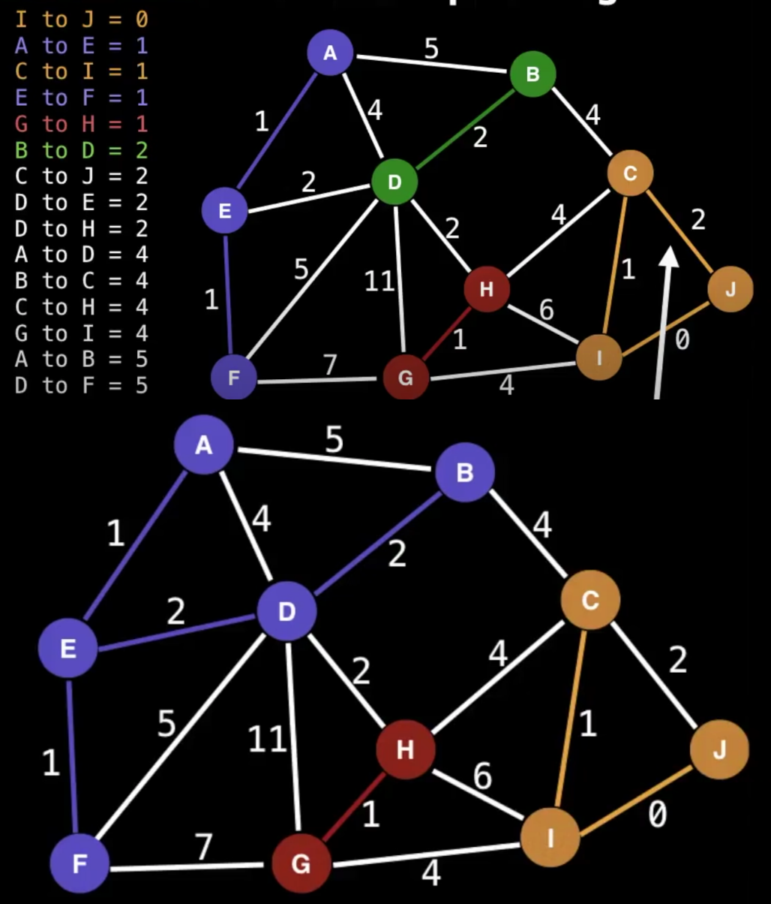
* 观察C_J，因为C和J已经在一个组里了，这条边就不需要了
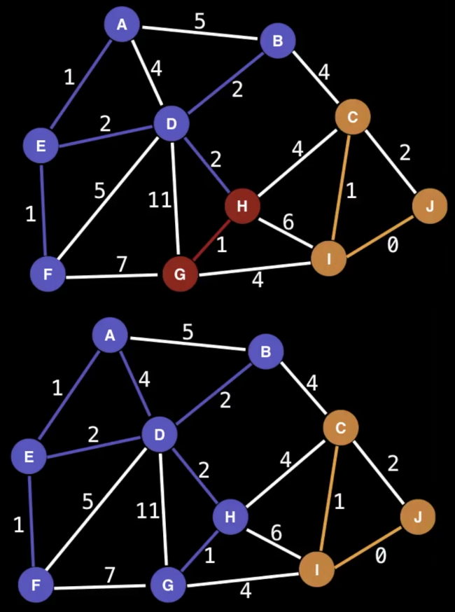
* 观察D_E，一旦连上后，紫色和绿色其实就是一个组了
* 观察D_H，一旦连上后，紫色和红色也成为了一个组
* 连接B_C，所有顶点就全部连上了，并且只有一条紫线

Find: 找元素在哪个component里，然后找到它的root
Union: 找两个元素分别在哪个component里，然后找到它们的root，如果不是同一个root，就让其中一个成为另一个的parent

* component的个数与root的个数一致
* root的个数只减不增（因为通常只合并而不拆分）

union find里
* 为每个元素分配一个索引，每个元素指向自己（即初始是n个root，n个component)
* 描述两两之间的关系，以任一元素为parent （谁来描述？）
* 有一个元素已经属于别的component里的，就将它也加到那个component里去
    * 如果这个元素也是别的component里的顶点，就把整个组指向另一个组的root


## Path Compression Union Find

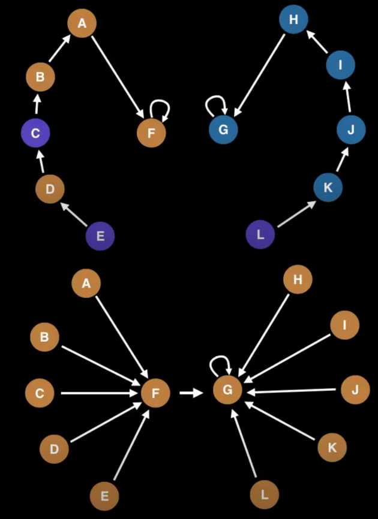
由一层层找到root改为所有顶点直接指向顶点（星形结构），实现路径压缩

这段代码演示的是，查找p的root节点，在查找的过程中，顺便进行了路径压缩
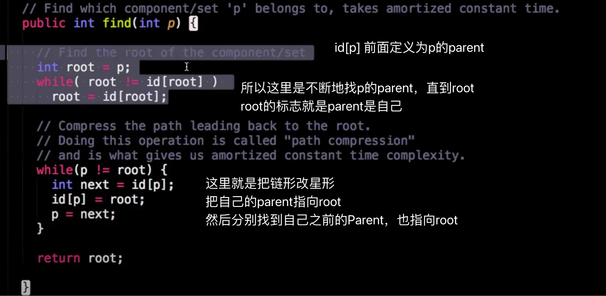

合并的逻辑就是比较谁的元素多就把谁当作root，另一个component的root的parent设为元素多的组的root    
合并完成后组数就少了1
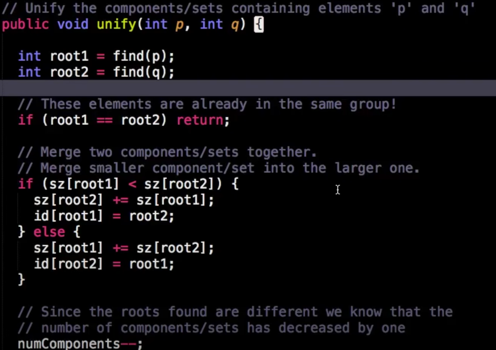
看代码，这一步里面并没有路径压缩，也就是小组里面的元素并没有进一步再星状地指向新的parent，仍然指向的是老的组的root

# Binary Trees and Binary Search Trees (BST)

Tree: 满足以下定义的`undirected graph`(无向图)

* An acyclic(非循环的) connected graph
* N nodes and N-1 edges
* 有且只有一条路径连接*任意*两个顶点

> 任意一个节点都可以被理解为root

**Binary Tree**
拥有最多两个节点的Tree

**Binary Search Tree**
服从以下特性的`binary tree`
* 左子树的元素小于右子树

拥有重复元素是允许的，但多数情况下我们只研究不重复的元素

这是一个有效的BST吗？
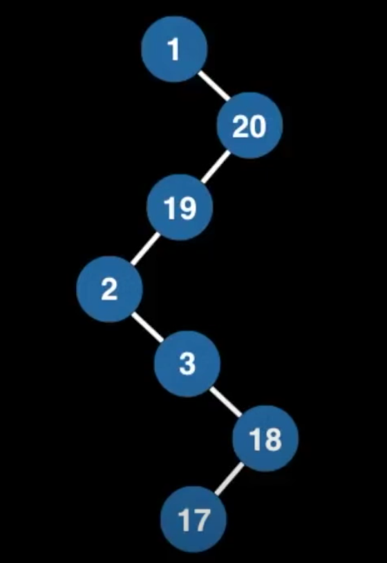

是的（对于单链下来的，几乎会直接就满足右边比左边大）

**Usage**
* BSTs
    * implementation of some map and set ADTs
    * red black trees
    * AVL trees
    * splay trees
    * ...
* binary heaps
* syntax trees (by compiler and calculators)
* Treap - a probabilistic DS (uses a randomized BST)

**Complexity**
增删查平均为O(log n)，但最差情况下都为O(n)，即线性时间

**Adding elements to a BST**
* 第一个为root
* 每一个新数，比顶点大，放右边，比顶点小，放左边，顺序下行
    * 不是从左到右摆满再做subtree
    * 比如3,6,9, 会得一棵全部数字摆在右边的数，而不是顶3左6右9的三角形
    * 这也是为什么极端情况下，时间复杂度是`O(n)`，因为就是一条线到底
    * 这也是`balanced binary search trees`被引入的原因

**Removing elements from a BST**
* find
    * 从root开始，小的走左右，大的走右边
* replace (to maintain the BST invariant)

找继任者的时候，如果删除元素没有子节点，只有左或右子节点，都很好办，但如果它有两个子节点，那么应该用哪个来接续呢？

原则仍然是要服从左边的比右边的小，所以你其实有两种选择：
* 把左边最大的数选出来 或
* 把右边最小的数选出来
因为它们的“来源”，肯定是能保证bst invariant的（自己多画几次），只是把找到的元素复制过去后，多了的那个怎么办呢？
* 递归
新找到的元素当然要从原来的位置删除，这时又根据它是否叶节点，单子节点还是全节点，来反复进行前面的操作，最终总是可以退出的

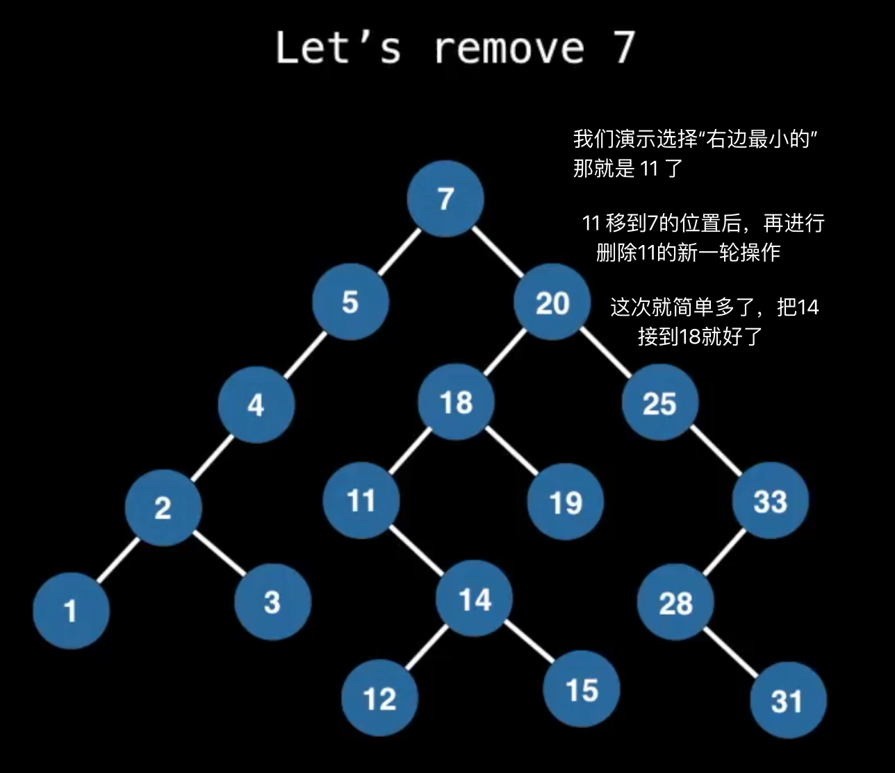
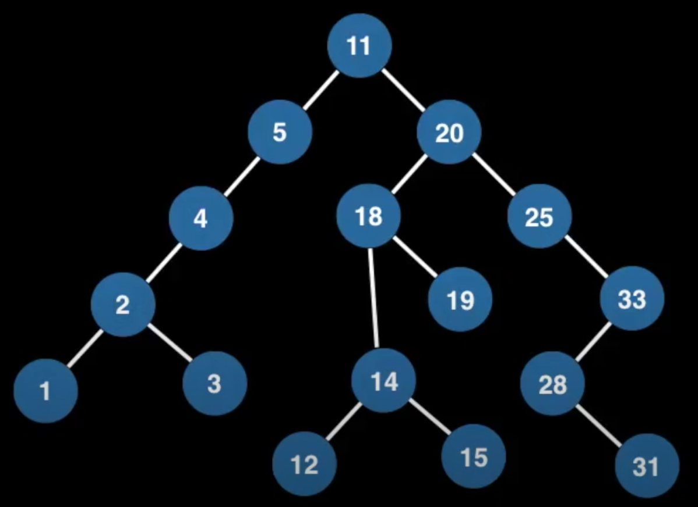

## Tree Traversals

(Preorder, Inorder, Postorder & Level order)

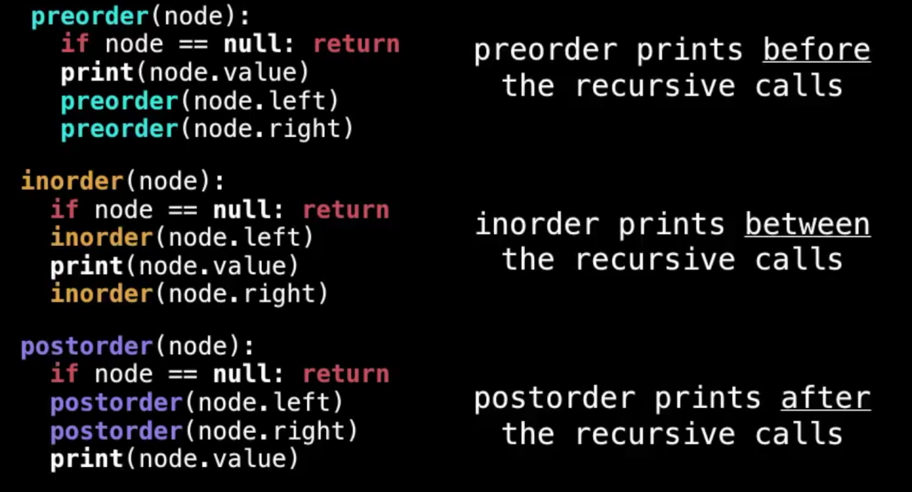

* preorder，在遍历左侧元素的时候，每次已经先取到元素了（最顶层）
* inorder里，遍历元素的时候，直到所有的left走完了，才取到第一个元素（最底层的）
* postorder里，也是遍历到最底层，但是下一步就是取兄弟节点了

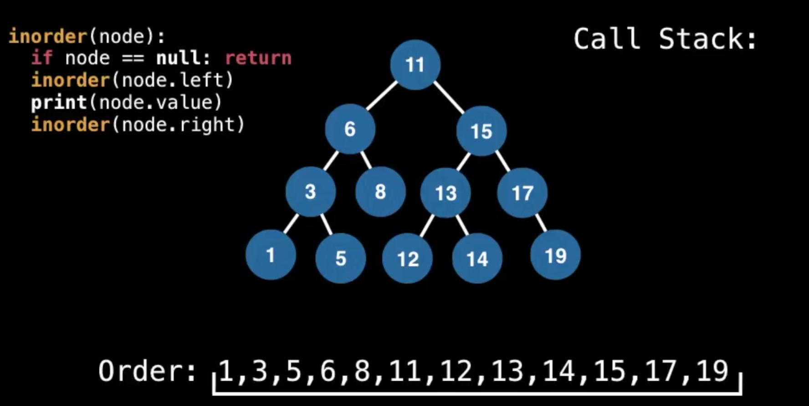
inorder一个重要特征：它是从小到大排好序的！

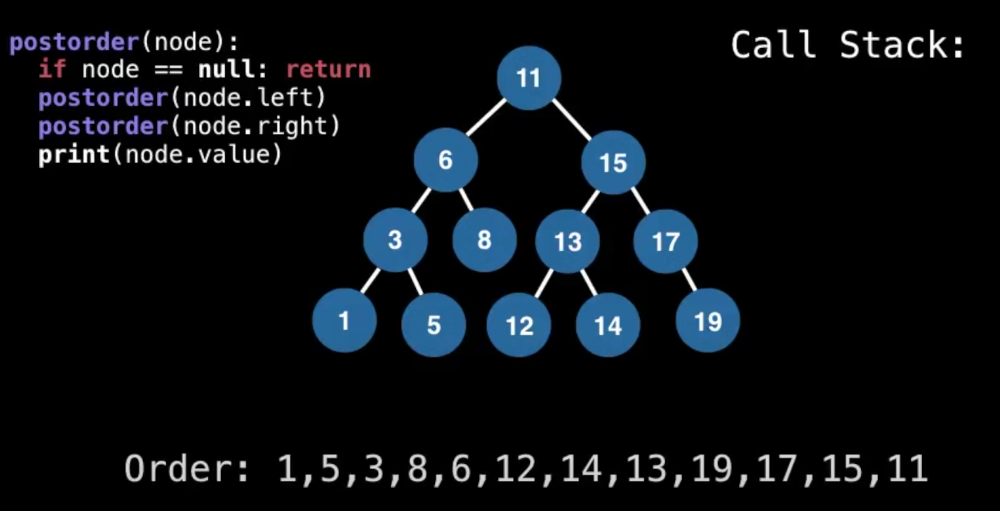
preorder 和 postorder没什么特征，举一个post的例子观察下

而levelorder则是一`层`一层地取的：
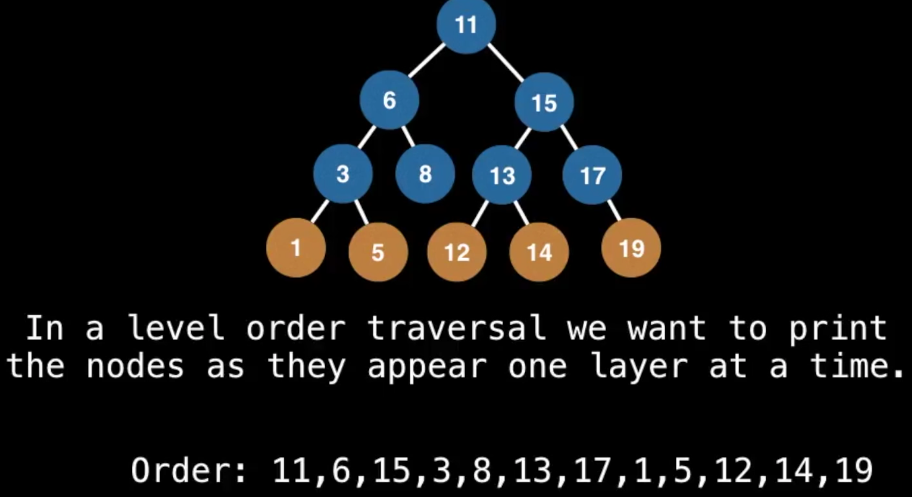
这就是广度优先了（`Breadth First Searth`)BFS

实现BFS
1. 每处理一个parent的时候，把parent加到结果数组里
2. parent的子节点加到队列里
3. 每次从队列里取出一个值加到结果数组里（步骤1）
4. 该值的child加到队列里（步骤2）

其实就是步骤1，2的重复，比如：
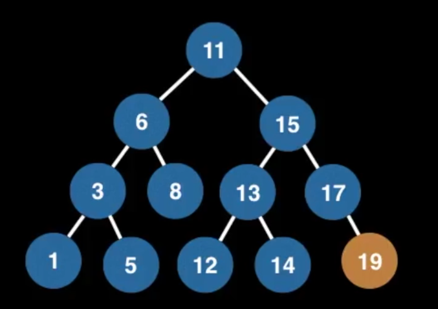
```
[11], [6, 15] 处理第1个数11， 队列里多了两个元素6， 15
[11, 6], [15, 3, 8] 从队列里取出6， 加入结果，它的子元素(6, 8)加入队列
[11, 6, 15], [3, 8, 13, 17]
[11, 6, 15, 3], [8, 13, 17, 1, 5]
[11, 6, 15, 3, 8], [13, 17, 1, 5] 这一步，8没有子节点了，队列变短了
[11, 6, 15, 3, 8, 13], [17, 1, 5, 12, 14]
[11, 6, 15, 3, 8, 13, 17], [1, 5, 12, 14, 19] 17只有一个child
[11, 6, 15, 3, 8, 13, 17, 1, 5, 12, 14, 19] 剩下的都没child了，全部拼进去
```

# Hash Tables

* key-value pair
* using `Hashing` technique
* often used tracking item frequencies

what's *hash function*?
- maps a key `x` to a whole number in a fixed `range`.
    - e.g. $H(x) = (x^2 - 6x + 9) % 10$ maps (0, 9)
    - 这个方程会为不同的x产生一样的y -> `hash collision`
- can hash arbitrary objects like string, list, tuple...
- must be `deterministic`(确定的x产生确定的y)
    - 因此key的应该是`immutable`的类型

关键词是`range`，你设计的function总要mod一下，将结果限制在一个范围内。这里你应该暂时能推测出hashtable的key可能就是数字吧？

**hash collision**

* `separate chaining`
用一种数据结构（通常是链表）保留所有冲突的值
* `open addressing`
为冲突的值选择一个offset（地址/值）保存 -> `probing sequence P(x)`

不管是怎么解决冲突，**worst**的情况下，hash table的操作时间也会由O(1)变成O(n)

怎么用HT来查找呢？不是把hash后的结果拼到原数据上，而是每次查询前，对key进行一次hash function，就能去查询了。

## Open Addressing

**probing sequences**
* linear probing: P(x) = ax + b
* quadratic probing: p(x) = $ax^2 + bx + c$
* double hashing: p(k, x) = $x * H_2(k)$ 双重hash
* pseudo random number generator: p(k, x) = x * rng(H(k), x) 用H(k)(即hash value)做种的随机数

总之就是在这样一个序列里找下一个位置

假设一个table size 为N的HT，使用开放寻址的伪代码：
```python
x = 1
keyHash = H(k)   # 直接计算出来的hash value
index = keyHash  # 偏移过后存在HT里的index

while table[index] != None:
    index = (keyHash + P(k, x)) % N  # 加上偏移，考虑size（N）
    x += 1 # 游标加1

# now can insert (k,v) at table[index]
```

### Chaos with cycles

**Linear Probling (LP)**

LP中，如果你*运气不好*，产生的序列的下一个值永远是occupied的状态（一般是值域小于size），就进入死循环了。

假设p(x) = 3x, H(k) = 4, N = 9
那么H(k)+P(x) % N 只会产生{4,7,1}，如果这三个位置被占用，那就陷入了永远寻找下一个的无限循环中。

一般是限制probing function能返回刚好N个值。
> 当p(x)=ax的a与size的N互质，即没有公约数，`GCD(a, N) = 1`一般能产生刚好N个值。(Greatest Common Denominator)

>注意，为了性能和效率的平衡，有`load factor`的存在，所以到了阈值，size就要加倍，N的变化，将会使得`GCD(a, N) = 1`的a的选择有变化，而且之前对N取模，现在取值也变发生变化，这时候需要重新map

重新map不再按元素当初添加的顺序，而是把现有HT里的值按索引顺序重新map一遍。比如第一个是k6, 即第6个添加进来的，但是现在第一个就重新计算它的值，填到新的HT里面去。

**Quadratic Probing （QP）**

QP 同样有chaos with cycles的问题，通用解决办法，三种：
1. p(x) = $x^2$, size选一个 prime number > 3, and $\alpha \leq \frac{1}{2}$ 
2. p(x) = $(x^2 + x) / 2$, keep the size a power of 2 （不需要是素数了）
3. p(x)= $(-1^x) \times x^2$, make size prime N $\equiv 3$ mod 4 ???

**Double Hashing**

Double Hashing: P(x) = $x \times H_2(k)$可见仍然类似一个一次的线性方程，$H_2(k)$就类似于ax中的a，设为$\delta$，相比固定的a, 这里只是变成了动态的，这样不同的key的待选序列就是不一样的（可以理解为系数不同了）

解决chaos:
1. size N to be a prime number
2. calculate: $\delta = H_2(k)$ mod N
    * $\delta=0$ 时offset就没了，所以需要人为改为1
    * $1 \leq \delta \lt N$ and GCD($\delta$, N) = 1

可见，虽然系数是“动态”的了，但是取值还是（1，N）中的一个而已，hash只是让其动起来的一个原因，而不是参与计算的值。`〔拼音〕

我们本来就是在求hash value，结果又要引入另一个hash function，显然这个$H_2$不能像外层这样复杂，一般是针对常见的key类型(string, int...-> fundamental data type)的`universal hash functions`

>因为N要是一个素数，所以在double size的时候，还要继续往上找直到找到一个素数为止，比如N=7, double后，N=14，那么最终，N=17

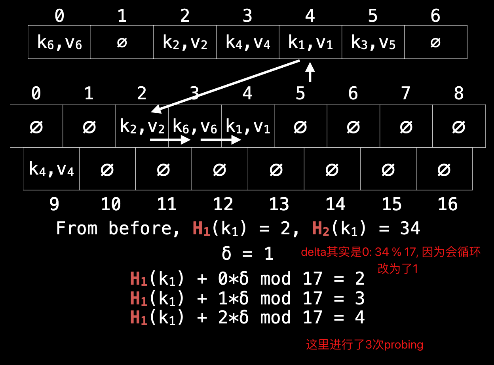

### Issues with removing

因为冲突的hash value需要probing，probing的依据是从序列里依次取出下一个位置，检查这个位置**有没有被占用**，那么问题就来了，如果一个本被占用的位置，因为元素需要删除，反而变成没有占用了，这有点类似删除树节点，不但要考虑删除，还要考虑这个位置怎么接续。

**lazy deletion**
但HT机制比树要复杂，为了避免反复应用probing函数重新摆放后续所有节点，干脆就在删除的位置放置一个预设的标识，我们称为墓碑(`tombstone`)而不是直接置空，然后所有的查找和添加加上这一条规则，就能快速删除又无需重新排序。

大量删除会造成空间浪费，但无需立即处理：
1. 添加元素允许添加到墓碑位置
2. 到达阈值容量需要倍增的时候有一次重排，这个时候就可以移除所有的墓碑

如果查找一个hash value，连续3个都是墓碑，第4个才是它，这是不是有点浪费时间？确实，所以还可以优化，当你查找过一次之后，就可以把它移到第一个墓碑的位置，这样，**下次**查询的时候速度就会快很多了。

整个机制，叫`lazy deletion`

# Fenwick Tree (Binary Indexed Tree)

树状数组

**Motivation**

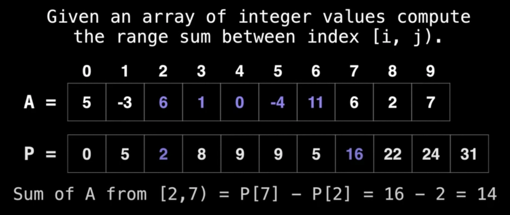
* 计算数组里任意连续片段的和，最直观的方案当然是累加O(n)
* 但是如果你有一个记录了每个节点到当前位置时的累加和的数组（`prefix sum`），立刻变成了常量时间
* 问题更新数据变成了线性时间（后续所有的求和都要改一变）
    * great for `static arrays`

所以：
Fenwick Tree is an efficient data structure for performing range/point queries/updates.(即在上面的动机上，还考虑了update的效率)

前面的例子在update时效率不高，所以Fenwick Tree用了一种聪明的方式，不是累加所有的值，而是分段累加，具体实现看下图：
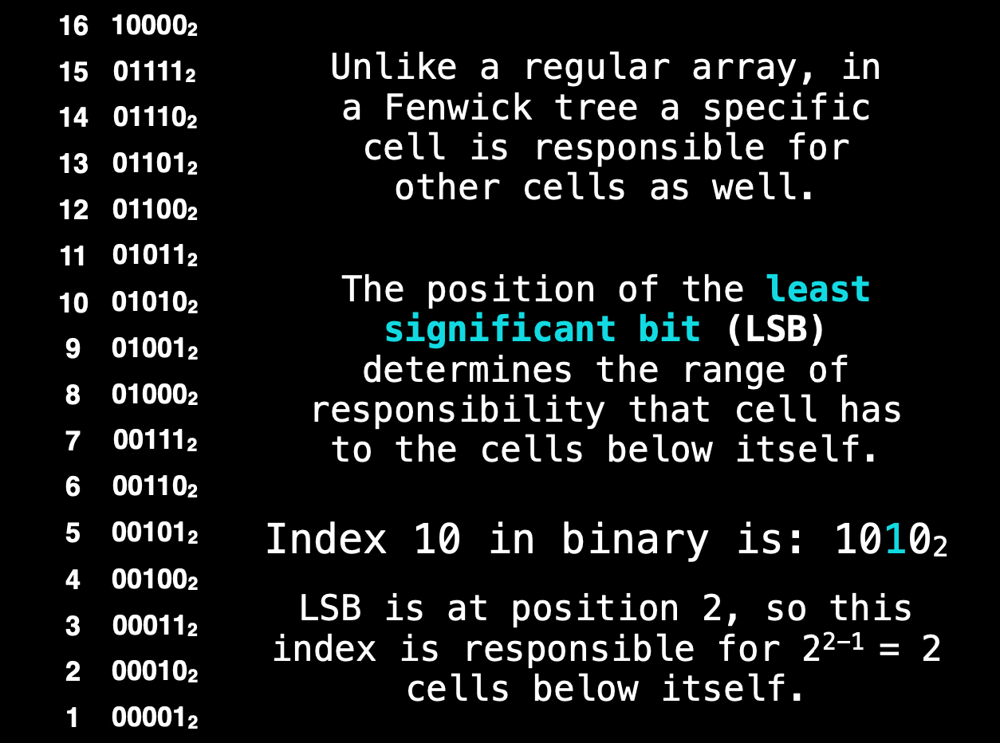
* 把索引值用二进制表示
* `LSB`的解释看图，实际应用上，就是看从低位到高位第一个1的右边有几个0，假设为`n`个
* 那么该cell上存的值就是前$2^n$个cell的值的和

例子是索引10， 二进制是1010， 最右边有2个零，那么它保存它4个位置的和。
也就是说，如果你要求和，如果用了cell 10位置的值的话，至少可以省掉3次累加。

当然，它还有更牛逼的特性，结合range query一起来看吧：
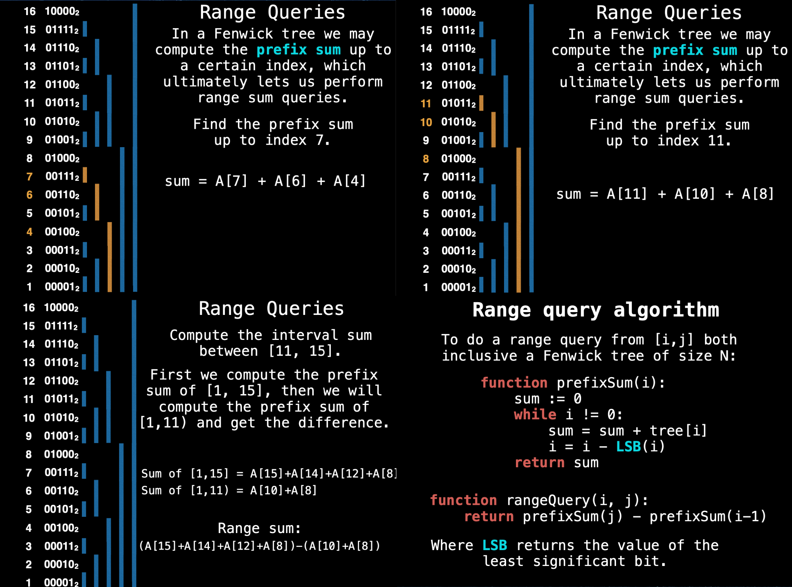
蓝线表示的是当然位置上累加了前几个位置的值，已经很有规律了

假如计算前11个值的和，过程是：
1. 11的索引是1011，右边没有0，所以当前的和为A[11]
2. 根据$2^0$来移位，来到10。
    * 右边一个0，所以它管$2^1$个presum，目前A[11] + A[10]
    * 下一个索引自然要减2了，来到8
3. 8是1000，3个零，所以它存了$2^3=8$个值的和，那就是全部了

所以：sum = A[11] + A[10] + A[8]

* 心算sum(0,7)巩固一下
* 用sum(11,15)演示子区间，其实就是多减1次，至于是减到10还是减到11，看描述，比如这里11是要参与计算的，那就是把前10个减掉就行了。

上面演示的都是`worst`的情况，即首位为1，除了这种情况，别的位都至少存了前$2^n$个元素的值（比如16，直接得到16个元素的和）

> 这里都没讲你是怎么做这个tree的，而是怎么使用它。先弄清楚使用场景再谈构建。

## Point Update

复习一下`LSB`，虽然可以直接数最右边的零的个数，但数学其实是：
* 13 = 1101 ($2^3 + 2^2 + 2^0 \Rarr 10^3 + 10^2 + 10^0 $)
* 减去最右边的1和0 => 1100 （$2^3+2^2=12$) 所以下一个数是12
* 减去最右边的1和0 => 1000 就是8了
* 再减就是0了
而按$2^n$来计算个数的话就是这样的：
* 13 = 1101, 没有0，就是移1位，变成12
* 12 = 1100， 2个0， 就是移4位，变成8
* 8 = 1000， 3个0， 移8位，变成0

现在来讲update，前面知道，update会级联影响到所以把该cell考虑进去的节点，因此，它需要反着往上找（极端情况当然是找到最后一个元素，通常这个元素就是整个数组的值，所以任何元素的更改，肯定都会影响到它）

前面找下一个节点用的是减法，现在就要用加法了，比如我更新了cell 9, 用以上两种任意一种方法来计算：
* $9 = 2^3 + 1 \Rarr 10^3 + 1 = 1001, +1 = 1010 = 10$
* 1010 + 10 = 1100 = 12
* 1100 + 100 = 10000 = 16 到顶了，
所以需要把9, 10, 12, 16分别应用这个point的更新，也就是说只有这几个cell把9计算进去了。

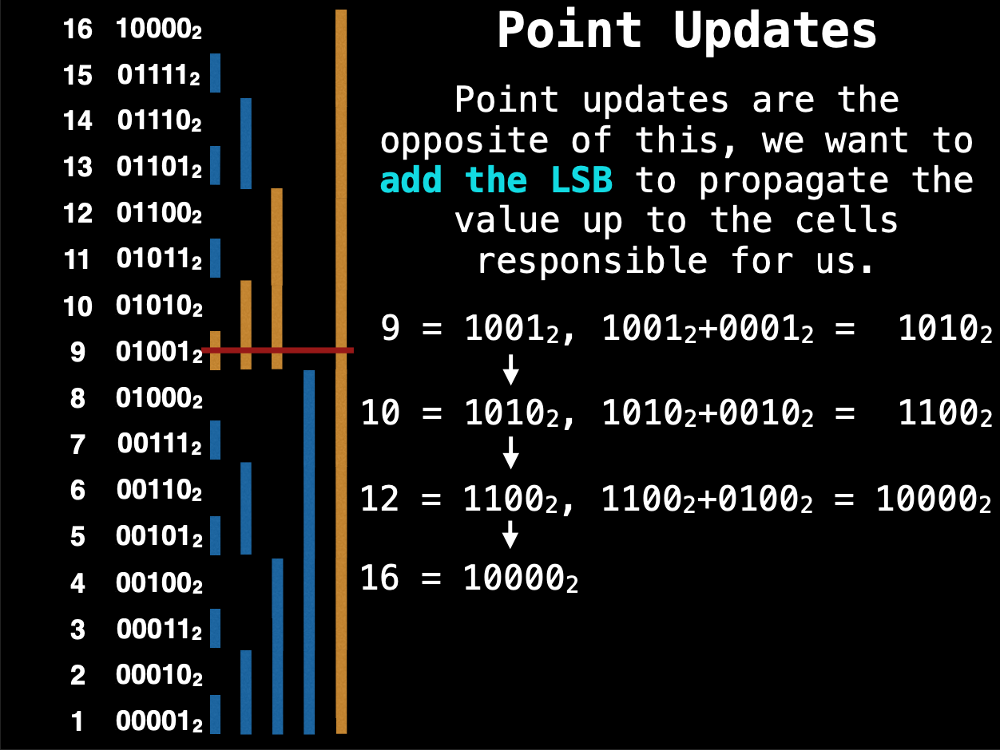
当然，可以看一下左边的示意图，更直观

```python
function add(i, x): 
    while i < N:
        tree[i] = tree[i] + x 
        i = i + LSB(i)
```
代码非常简单，就是不断通过LSB找下一个位置去更新就行了。

## Construction

现在来讲构建
```python
function construct(values): N := length(values)
    # Clone the values array since we’re # doing in place operations
    tree = deepCopy(values)
    for i = 1,2,3, ... N:
        j := i + LSB(i)
        if j < N:
            tree[j] = tree[j] + tree[i]
    return tree
```

几乎就一句话，就是把元素按原数据摆好（即不加别的节点）后，每次找到当前元素影响的上一级（不再向上冒泡）
* 比如1，把1算进去的有2，虽然上面还有4， 8， 16，但只把1更新到2
* 到2的上一级是4 (2 + lsb(2) = 4), 把节点2的现值（已经加了节点1）加到4去
* 所以核心算法始终只有两个变量，i，j代表最近的包含关系

**些算法换成位运算**
* lsb(i): `i & -i`
* i -= lsb(i) => `i &= ~lsb(i)`

# Suffix Array

* 字符串的所有子字符串后缀组成数组
* 对子串根据首字母进行排序
* 排序后原有的index就被打乱了
* 这个乱序的indices就是`Suffix Array`

做尾缀子串的时候通常是从单单词开始越找越多，这就有了一个原生顺序，然后用首字母排序后，这个顺序就被打乱了

提供了一种`compressd representation` of sorted suffixes而无需真的把这些子串存起来（从这句话看来，生成子串一定是有固定顺序的，以至于你用索引就能对应起来），另一个问题来了，那顺序排列也可以找到任一子串啊，仍然不明白为什么要用字母排序把顺序的index打乱一下。

* A space efficient alternative to a `suffix tree`
    * a compressd version of a `trie`?

能做所有`suffix tree`能做的事，并加添加了`Longest Common Prefix`(LCP) array

# Longest Common Prefix (LCP) array

继续上面的Suffix Array，字母排序后，我们一个个地用每一个元素同上一个元素比，标记相同前缀的字母个数，这个数字序列就是`LCP`

比如aba, adc, 前缀`ab`是相同的，那就是2。

第一个元素没有“上一个”去比，所以LCP数组第1位永远是0？（是的，其实是undefined，但一般设0）

衡量的是相邻的suffix array元素的前缀间有多少个字母相同。

当前也可以和下一个元素比（这样最后一个元素的LCP肯定是0了，原理同上）

## Find unique substrings

找到（或计数）一个数组的所有（不重复的）子元素。可以逐个substring遍历，$O(n^2)$，下面看看更快也更省空间的LCP方案。

找“AZAZA”的不重复子串:
A,AZ,AZA,AZAZ,AZAZA,Z,ZA,ZAZ,ZAZA,`A,AZ,AZA,Z,AZ,A`，把重复的标注了出来。
LCP是这样的：
LCP|Sorted Suffixes|
-|-
0|A
1|AZA
3|AZAZA
0|ZA
2|ZAZA

我们知道第一列指的是“重复个数”，也就是说，如果按我们手写的那样去遍历，至少有这么多重复的子串，重复的既是“个数”，也是“组合方式”。

所以如果我们只需要计数的话，把右边的数出来就知道有会有多少个重复的了，此例为6.

$$\tt unique\ count = \underbrace{\frac{n(n+1)}{2}}_{substr\ count} - \underbrace{\sum_{i=1}^n LCP[i]}_{duplicates}$$

这是LCP的应用之一，利用了LCP本身就是在数重复次数的特征。

## K common substring problem

n个字符串，找出一个子串，它至少是k个字符串的子串，求最大子串。$2\leq k \leq n$

即如果有k=2，那么这个子串只需要是其中两个的子串就行了，如果k=n，那么就需要是每一个字符串的子串。

直接上图
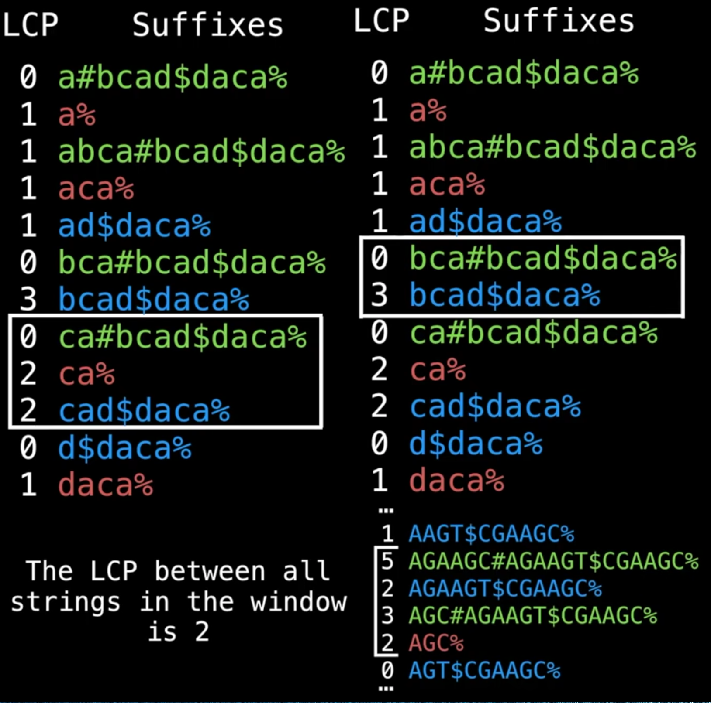


* 图1演示k=3时，找到了`ca`，即3个串里都有的是`ca`
* 图2演示k=2时，找到了`bca`，即`bca`存在2个串里
* 图3演示的是用了size=4的滑窗才包含了3个字符串，以及最大匹配是`AG`

步骤：
1. 首先，用几个分隔符把字符串拼接起来
    * 分隔符字符串里不会出现
    * 分隔符的排序要小于所有字符
2. 图中染色的依据是prefix是哪个串里的就染成什么颜色
3. 开始滑窗比较
    * 滑窗必须要能包含k种颜色
    * 所以滑窗大小不是固定的，有时候相邻几个都是来自同一个字符串
    * 滑窗里除0外的最小值，就是符合条件的最大共同长度，如图3，最大匹配长度是2
    * 课程里动画演示滑窗其实不是用滑的，而是用的爬行
        * 即下界往下，包含了所有颜色之后，上界也往下，这样蠕行前进，每一步判断滑窗里的内容
4. 额外需要一个hash table来保存切片与颜色的映射关系。
    * 如果是例子这么简单，我可以直接检查第一个出现的分隔符，是#就是绿色，出现$就是蓝色，%就是红色

核心就是：
* 取子串是从后向前取的
* 但比较是从前向后比的
* 前面的元素可能来自任何一个子串（只要足够长）
* 从前面排序，客观上就把来自不同字符串的相同字母打头的子串给排到一起了

这就是为什么在`Suffix` Array的内容里面出现Longest Common `Prefix`的内容的原因了.

聪明。

## Longest Repeated Substring (LRS)

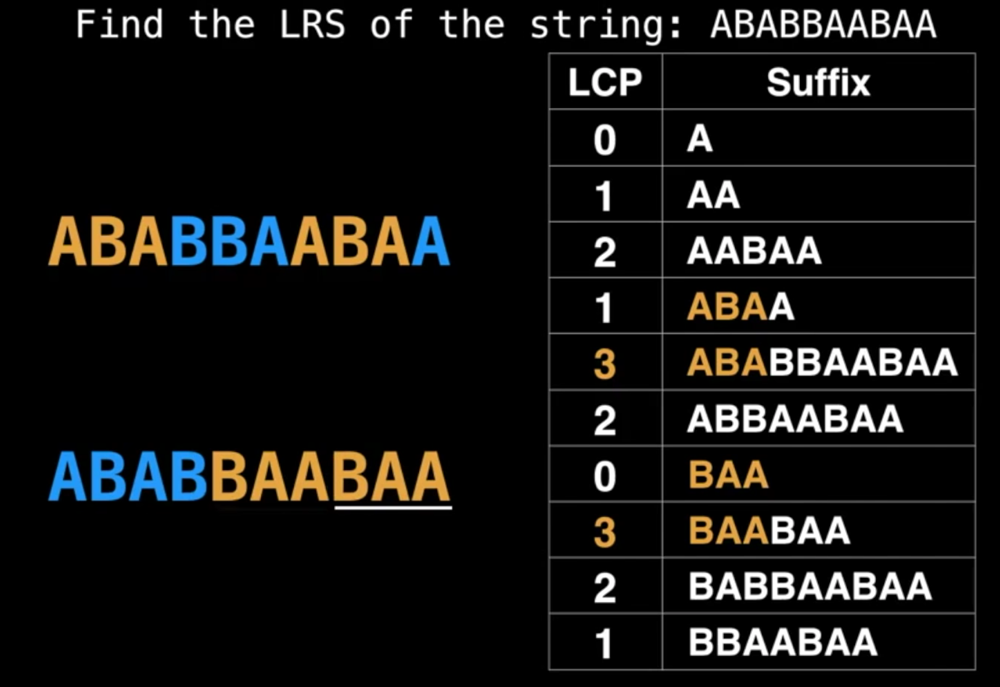

这个比暴力遍历要简单太多，直接找LCP最大值即可

# Balanced Binary Search Trees (BBST)

* 满足low (logarithmic) height for fast insertions and deletions
* clever usage of a `tree invairant` and `tree rotation`

## AVL Tree

一种BBST，满足O(log n)的插入删除和查找复杂度，也是第一种BBST，后续出现的更多的：2-3 tree, AA tree, scapegoat tree, red-black tree(avl的最主要竞争对手)

能保持平衡的因子：Balance Factor (`BF`)

* BF(node) = H(node.right) - H(node.left)
* H(x) = height of node = # of edges between (x, furthest leaf)
* 所以要能平衡，BF基本只能是(-1, 0, 1)等值 <- avl tree invariant

一个node需要存：
* 本身的(comparable) value
* balance factor
* the `height` of this node
* left/right pointer