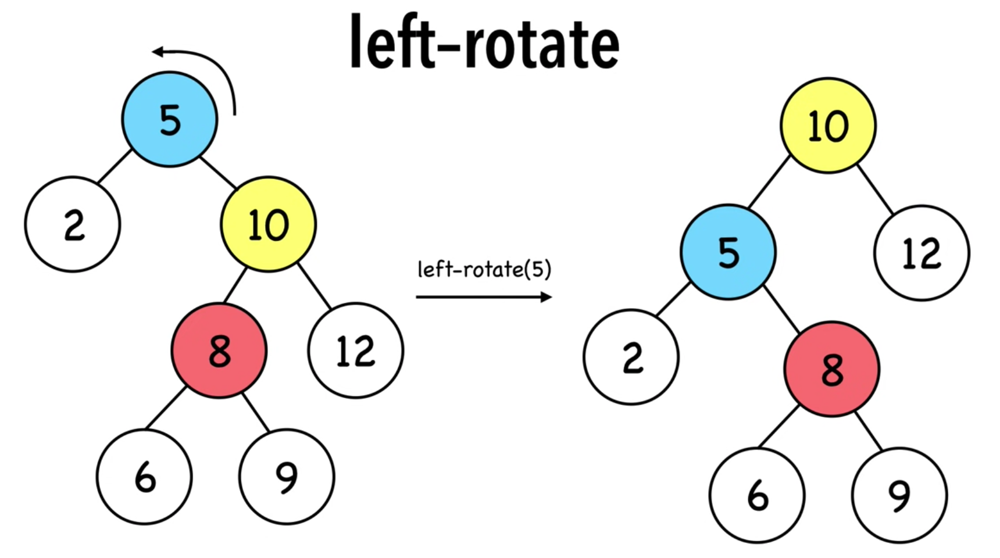
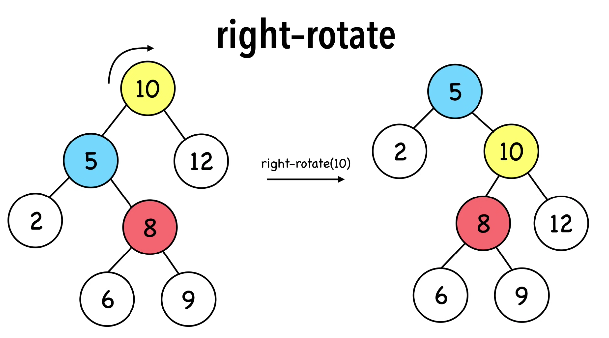

# Bid O notation

* 我们想考量程序执行时间的频度T(n)，找到一个f(n)，有: n趋近无穷大时，T(n)/f(n)是一个不为零的常数，那么两函数量级相同，`T(n) = O(f(n))`
    * 其实就是你把T(n)画出来，有一个f(n)的曲线与它是一样的，除了截距
    * 只是那么个意思，真正函数执行的时间还跟机器配置和环境有关，而数学函数的曲线肯定是不会变的
* f(n)选取尽可能简单的函数的话，我们用它来表示T(n)就很直观了
* 因为考虑的是n无穷大时的级数，所以可以忽略常数的影响，忽略低次幂的影响
* 一般是看最坏的情况（即最大的时间消耗）

比如`for(int i = 1; i <= 8; ){i *= 2}`，在$2^3$后就大于8了，跳出了循环，$3 = log_2^8$，因此可以用$log_2^n$来度量，记作O(logn)

* 与n无关时，比如 `x+=1; y += 2;` 无论n为几，都只执行O(1)+O(1)=2O(1)次，忽略常数项，就是O(1)
* 而上式如果包在一个for循环里，则会重复n次：O(n)
* 双层循环里，显然有n*n次：O($n^2$)
* 如果存在其它提前跳出循环的情况，正确建模，比如每次减半/加倍，肯定是以2的倍数压缩时间，用对数来计算
* 所有句子的时间，相加的应用忽略低次幂原因，相乘的就直接相乘

# red-black tree

self balancing binary search tree

* a node is either red or black
* root and leaves (NIL) are black
* red's childern are black
* all path a nodde to NIL contain the same number of black nodes

## rotation

1. alerts the structure by `rearrange` subtrees
2. goal: descrease the `height` of the tree
    * red-black trees: maximum height of O(log n)
    * larger subtrees up, smaller subtrees down
3. no efection to the order of elements

**left rotation**

左右当然是相对的，我们可以理解从“左“到右还是从”右“到左，比如把右边的元素旋转到自己的parent，自然是要向”左“移，就叫**left** rotation:

下例中，对蓝5进行left rotation
* 目标就成了**右边**的子元素，黄10
* 黄10成为了5的parent后，5可以是它的left child, 也可以是right child
    * 定义成left child -> 所以这里也能对应上**left rotation**的left，即接在左边
    * 黄10原来的left child: 红8，就游离出来了
* 蓝5的10没了后，黄10游离出来的红8接上去

可以看到：
* 10（大数）上去了，5（小数）下来了
* 总结起来就是，左旋就是把大数放头上，小数接到自己的右脚（至少这张图是）

**right rotation**

推断一下，应该是（黄10）把左脚的元素（蓝5）丢到头上，然后左脚元素的右脚（红8）接上去：

