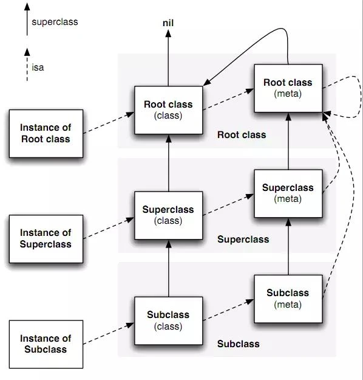
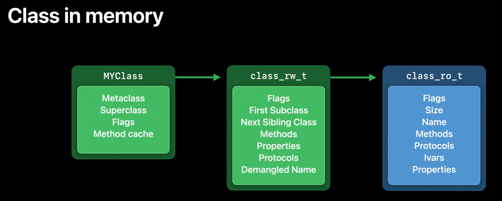
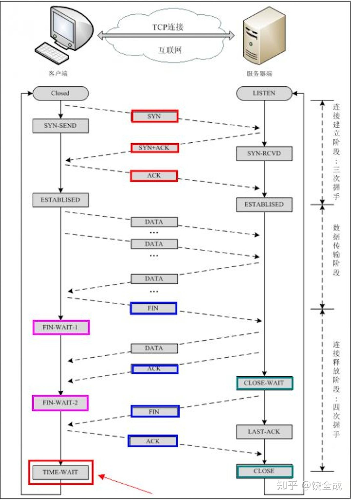

# 内存管理


ARC 背后的原理是依赖编译器的静态分析能力，通过在编译时找出合理的插入引用计数管理代码，从而彻底解放程序员。（其实就是交给runtime来管理）
* 当我们创建一个新对象的时候，它的引用计数为 1，
* 当有一个新的指针指向这个对象时，我们将其引用计数加 1，
* 当某个指针不再指向这个对象是，我们将其引用计数减 1，
* 当对象的引用计数变为 0 时，说明这个对象不再被任何指针指向了，这个时候我们就可以将对象销毁，回收内存。

在 Linux 文件系统中，我们用 ln 命令可以创建一个硬链接（相当于我们这里的 retain)，当删除一个文件时（相当于我们这里的 release)，系统调用会检查文件的 link count 值，如果大于 1，则不会回收文件所占用的磁盘区域。直到最后一次删除前，系统发现 link count 值为 1，则系统才会执行直正的删除操作，把文件所占用的磁盘区域标记成未用。

如果不传递引用，而是复制，则不会存在这些问题，但会带来大量的消耗。

对于一个 NSNumber 对象，如果存储 NSInteger 的普通变量，那么它所占用的内存是与 CPU 的位数有关，在 32 位 CPU 下占4个字节。而指针类型的大小通常也是与 CPU 位数相关，一个指针所占用的内存在32位 CPU 下为4个字节。但是迁移至64位系统中后，其占用空间达到了8字节，以此类推，所有在64位系统中占用空间会翻倍的对象，在迁移后会导致系统内存剧增，即时他们根本用不到这么多的空间。在2013年9月，苹果推出了iPhone 5s，该款机型首次采用64位架构的A7双核处理器。所以苹果对于一些小型数据(NSNumber、NSDate、NSString等)，采用了 taggedPointer 这种方式管理内存。

TaggedPointer 是一种为内存高效节省空间的方法,Tagged Pointer是一个特别的指针，它分为两部分：

一部分直接保存数据 ；
另一部分作为特殊标记，表示这是一个特别的指针，不指向任何一个地址；

objc_objcet 对象中 isa 指针分为指针型 isa 与非指针型isa(NONPOINTER_ISA)，运用的便是类似这种技术。下面详细解读一下NONPOINTER_ISA：

## 64位指针

在一个64位的指针内存中

* 第0位存储的是indexed标识符，它代表一个指针是否为NONPOINTER型，0代表不是，1代表是。
* 第1位 has_assoc，顾名思义，1代表其指向的实例变量含有关联对象，0则为否。
* 第2位为 has_cxx_dtor，表明该对象是否包含 C++相关的内容或者该对象是否使用 ARC 来管理内存，如果含有 C++ 相关内容或者使用了 ARC 来管理对象，这一块都表示为 YES，
* 第3-35位 shiftcls存储的就是这个指针的地址。
* 第42位为 weakly_referenced，表明该指针对象是否有弱引用的指针指向。
* 第43位为 deallocing，表明该对象是否正在被回收。
* 第44位为 has_sidetable_rc，顾名思义，该指针是否引用了 sidetable 散列表。第
* 45-63位 extra_rc 装的就是这个实例变量的引用计数，当对象被引用时，其引用计数+1，但少量的引用计数是不会直接存放在 sideTables 表中的，对象的引用计数会先存在 NONPOINTER_ISA 的指针中的45-63位，当其被存满后，才会相应存入 sideTables 散列表中。

## 散列表(sideTables)
散列表在系统中的体现是一个 sideTables的哈希映射表，其中所有对象的引用计数（除上述存在 NONPOINTER_ISA 中的外）都存在这个 sideTables 散列表中，而一个散列表中又包含众多 sideTable 结构体。每个 SideTable 中又包含了三个元素，`spinlock_t 自旋锁`，`RefcountMap 引用计数表`，`weak_table_t 弱引用表`。
它使用对象的内存地址当它的 key。管理引用计数和 weak 指针就靠它了。

> 就是内存地址是key，指向这个内存的“指针们”就是值，某内存地址引用为零时，反查出这些指针，将其置nil

## Atomic

atomic 和 nonatomic 的区别在于，系统自动生成的 getter/setter 方法不一样。如果你自己写 getter/setter，那 atomic/nonatomic/retain/assign/copy 这些关键字只起提示作用，写不写都一样。

```objective-c
// @property(nonatomic, strong) UITextField *userName;
// 系统生成的代码如下：

- (UITextField *) userName {
    return userName;
}

- (void) setUserName:(UITextField *)userName_ {
    [userName_ retain];
    [userName release];
    userName = userName_;
}

// @property(retain) UITextField *userName;  // 不写就是atomic
// 系统生成的代码如下：
// 可见加了锁

- (UITextField *) userName {
    UITextField *retval = nil;
    @synchronized(self) {
        retval = [[userName retain] autorelease];
    }
    return retval;
}

- (void) setUserName:(UITextField *)userName_ {
    @synchronized(self) {
      [userName release];
      userName = [userName_ retain];
    }
}
```

管读写安全，但不管生命安全，比如几个线程来读写，atomic锁的机制会让他们变成串行操作，但是如果有release等消息发过来，还是会并行处理掉。

标记atomic的property生成的getter、setter内部使用了spinlock_t自旋锁保证了getter、setter的访问安全。

这里的spinlock_t并不是真正的自旋锁，iOS 10以后，底层换成了os_unfair_lock(互斥锁)。

> 因为反正不能保证线程安全，iOS应用几乎所有属性都可以设置为`nonatomic`

## 浅拷贝与深拷贝

浅拷贝就是对象地址不变（引用数加1），但是指针多了一个（所以引数才会加1）
深拷贝就是内容复制

* immutable对象的copy方法进行了浅拷贝
* immutable对象的mutableCopy方法进行了深拷贝
* mutable对象的copy方法进行了深拷贝
* mutable对象的mutableCopy方法进行了深拷贝。

[initWithArray: copyItems:]
* 如果为true，则是每一个元素都会`copyWithZone`
* 如果为false，那么每个元素只会被retain一次

## @property

当我们用@property来声明属性变量时，编译器会自动为我们生成一个以下划线加属性名命名的实例变量（`@synthesize` copyyStr = _copyyStr），并且生成其对应的getter、setter方法。
当我们用self.copyyStr = originStr赋值时，会调用coppyStr的setter方法，而_copyyStr = originStr 赋值时给_copyyStr实例变量直接赋值，并不会调用copyyStr的setter方法，而在setter方法中有一个非常关键的语句：
_copyyStr = [copyyStr copy];

> 所以用点语法赋值其实是copy，而直接用赋值给下划线的话就看你代码是什么了。

## @synthesize

你重写了属性的getter和setter，系统就不会生成对应的ivar（带下划线的实例变量），这时
* 要么，手动添加实例变量：NSString *_title;
* 要么，手动synthesize一下

## copy

copy的属性就是为了自己持有，
* 要么这个对象可能会改变（比如mutable string, array等）
* 要么这个对象可能会消失（比如block里捕获外部变量)

对string进行copy，是浅拷贝（有新指针，没新对象）
对mutable string进行copy，是深拷贝（内容复制，新指标，新对象） -> 拷贝后变成了immutable string

而对`block`进行copy是MRC的遗留产物，在某个方法体内定义一个block并设置为一个对象的属性的时候，这个block是一个（方法里普通的分配到）栈上的local variable，所以这个方法退出后，这个block也就消失了。

而ARC时代会自动copy，苹果希望你仍然保留copy是在书面上明示一下，但是不写或者strong也没问题了。

## @dynamic

当一个属性声明为 dynamic 时 就是告诉编译器：开发者一定会添加 setter/getter 的实现，而编译时不用自动生成。

你没有提供setter/getter编译时也不会报错，但运行时你没有提供相应的方法就会导致程序崩溃

## @synchronized

它是加锁，但又不是NSLock，它用着更方便，可读性更高。

```objective-c
- (void)push:(id)element
{
    [_lock lock];
    [_elements addObject:element];
    [_lock unlock];
}

// synchronized版本：
- (void)increament:(id)element
{
    @synchronized(self) {
        [_elements addobject:element];
    }
}
```

* 你可以给任何 Objective-C 对象上加个 @synchronized。那么我们也可以在上面的例子中用 @synchronized(_elements) 来替代 @synchronized(self)，效果是相同的。
* @synchronized block 在被保护的代码上暗中添加了一个异常处理。为的是同步某对象时如若抛出异常，锁会被释放掉。
* @synchronized block 会变成 `objc_sync_enter` 和 `objc_sync_exit` 的成对儿调用。(`<objc/objc-sync.h>`)

```objective-c
typedef struct SyncData {
    id object;
    recursive_mutex_t mutex;
    struct SyncData* nextData;
    int threadCount;
} SyncData;

typedef struct SyncList {
    SyncData *data;
    spinlock_t lock;
} SyncList;

// Use multiple parallel lists to decrease contention among unrelated objects.
#define COUNT 16
#define HASH(obj) ((((uintptr_t)(obj)) >> 5) & (COUNT - 1))
#define LOCK_FOR_OBJ(obj) sDataLists[HASH(obj)].lock
#define LIST_FOR_OBJ(obj) sDataLists[HASH(obj)].data
static SyncList sDataLists[COUNT];
```

* SyncList相当于一个链表，元素是SyncData（含有一个互斥锁），生成一个 data 时用 obj 的内存地址参与hash，添加到链表里
* 当你调用 `objc_sync_enter(obj)` 时，它用 obj 内存地址的哈希值查找合适的 SyncData，然后将其上锁。
* 当你调用 `objc_sync_exit(obj)` 时，它查找合适的 SyncData 并将其解锁。

> swift中直接将synchronize删除了换成了上述`enter/exit`对

objc_sync_enter 里面没有 `retain` 和 `release`。所以它要么没有保持传递给它的对象，要么或是在 ARC 下被编译。

1. synchronized 的 obj 为 nil 怎么办？
    加锁操作无效。

2. synchronized 会对 obj 做什么操作吗？
    会为obj生成递归自旋锁，并建立关联，生成 SyncData，存储在当前线程的缓存里或者全局哈希表里。

4. synchronized 和 pthread_mutex 有什么关系？
    SyncData里的递归互斥锁，使用 pthread_mutex 实现的。

5. synchronized 和 objc_sync 有什么关系？
    synchronized 底层调用了 objc_sync_enter() 和 objc_sync_exit()

可以用synchronized来实现不通过GCD的单例：
```objective-c
+ (instancetype)allocWithZone:(struct _NSZone *)zone {
    static id instance = nil;
    @synchronized (self) { // 互斥锁
        if (instance == nil) {
            instance = [super allocWithZone:zone];
        }
    }
    return instance;
}
```
不用`allocWithZone`也没关系，比如`sharedInstance`，使用的时候知道是什么名称就行。

# Runtime

 OC 是一门动态语言，函数调用变成了消息发送，在编译期不能知道要调用哪个函数。所以 Runtime 无非就是去解决如何在运行时期找到调用方法这样的问题。
 instance -> class -> method -> SEL -> IMP -> 实现函数

* 当一个对象 sender 调用代码[receiver message];的时候，实际上是调用了runtime的objc_msgSend函数，
* 所以OC的方法调用并不像C函数一样能按照地址直接取用，而是经过了一系列的过程。
* 这样的机制使得 runtime 可以在接收到消息后对消息进行特殊处理，这才使OC的一些特性譬如：
    * 给 nil 发送消息不崩溃，
    * 给类动态添加方法和消息转发等成为可能。
* 也正因为每一次调用方法的时候实际上是调用了一些 runtime 的消息处理函数，OC的方法调用相对于C来说会相对较慢，
    * 但 OC 也通过引入 cache 机制来很大程度上的克服了这个缺点。

`isa`指向的是类对象，在里面可以找到方法，属性


* instance `isa` class
* class `isa` meta class
* `Root Class` 就是`NSObject`，没有超类
* 任何meta class `isa` **Root meta class**
* root meta class 的父类是root class
    * 要记得root class `isa` root meta class，这里反向指回来了

类中的 super_class 指针可以追溯整个继承链。向一个对象发送消息时，Runtime 会根据实例对象的 isa 指针找到其所属的类，并自底向上直至根类(NSObject)中 去寻找 SEL 所对应的方法，找到后就运行整个方法。

metaClass是元类，也有 isa 指针、super_class 指针。其中保存了`类方法`列表。
`isa`是一个`isa_t`结构体（ 

## objc_msgSend 函数的调用流程：

1. 检测 SEL 是否应该被忽略
2. 检测发送的 target 是否为 nil ，如果是则忽略该消息
3. 当调用实例方法时，通过 isa 指针找到实例对应的 class 并且在其中的缓存方法列表以及方法列表中进行查询，如果找不到则根据 super_class 指针在父类中查询，直至根类(NSObject 或 NSProxy).
4. 当调用类方法时，通过 isa 指针找到实例对应的 metaclass 并且在其中的缓存方法列表以及方法列表中进行查询，如果找不到则根据 super_class 指针在父类中查询，直至根类(NSObject 或 NSProxy). 
5. 如果还没找到则进入消息动态解析过程(resolve / forward)。
```c
+ (BOOL)resolveClassMethod:(SEL)sel;
+ (BOOL)resolveInstanceMethod:(SEL)sel;
//后两个方法需要转发到其他的类处理
- (id)forwardingTargetForSelector:(SEL)aSelector;  // 这个返回值是id，可见是期望你返一个能处理这个SEL的对象
- (void)forwardInvocation:(NSInvocation *)anInvocation;

// 调用一个不存在的方法：
[target performSelector:@selector(resolveAdd:) withObject:@"test"];

// 在target内部handle住
void runAddMethod(id self, SEL _cmd, NSString *string){
    NSLog(@"add C IMP ", string);
}

// 第一次补救
+ (BOOL)resolveInstanceMethod:(SEL)sel{
    // 原生方法返回No，
    // 这里加入自己的处理，其实就是把方法“添加”进去
    if ([NSStringFromSelector(sel) isEqualToString:@"resolveAdd:"]) {
        class_addMethod(self, sel, (IMP)runAddMethod, "v@:*");
    }
    return YES;
}

// 第二次补救
- (id)forwardingTargetForSelector:(SEL)aSelector {
    NSString * methodName = NSStringFromSelector(aSelector);
    if ([methodName isEqualToString:@"sendMessage:"]) {
        return [Man new];  // 即返一个能处理的对象
    }
    return [super forwardingTargetForSelector:aSelector];
}

// 第三次补救
// 先用下面的方法获得函数签名（参数，返回值）
- (NSMethodSignature *)methodSignatureForSelector:(SEL)aSelector {
    NSString * methodName = NSStringFromSelector(aSelector);
    if ([methodName isEqualToString:@"sendMessage:"]) {
        return [NSMethodSignature signatureWithObjCTypes:"v@:@"];
    }
    return [super methodSignatureForSelector:aSelector];
}

- (void)forwardInvocation:(NSInvocation *)anInvocation {
    SEL sel = [anInvocation selector];
    Man * tempObj = [Man new];
    if ([tempObj respondsToSelector:sel]) {
        [anInvocation invokeWithTarget:tempObj];
    }else {
        [super forwardInvocation:anInvocation];
    }
    
}
```

* ”v@:”意思就是这已是一个void类型的方法，没有参数传入。
* “i@:”就是说这是一个int类型的方法，没有参数传入。
* ”i@:@”就是说这是一个int类型的方法，又一个参数传入。

## objc/runtime.h定义的类，方法，属性，协议等：
```c++
typedef struct objc_method *Method;
typedef struct objc_ivar *Ivar;
typedef struct objc_category *Category;
typedef struct objc_property *objc_property_t;

struct objc_class {
    Class isa  OBJC_ISA_AVAILABILITY;

#if !__OBJC2__
    Class super_class                        OBJC2_UNAVAILABLE;
    const char *name                         OBJC2_UNAVAILABLE;
    long version                             OBJC2_UNAVAILABLE;
    long info                                OBJC2_UNAVAILABLE;
    long instance_size                       OBJC2_UNAVAILABLE;
    struct objc_ivar_list *ivars             OBJC2_UNAVAILABLE; // 成员变量地址列表
    struct objc_method_list **methodLists    OBJC2_UNAVAILABLE; // 方法地址列表
    struct objc_cache *cache                 OBJC2_UNAVAILABLE; // 缓存最近使用的方法地址，以避免多次在方法地址列表中查询，提升效率
    struct objc_protocol_list *protocols     OBJC2_UNAVAILABLE; // 遵循的协议列表
#endif

} OBJC2_UNAVAILABLE;
/* Use `Class` instead of `struct objc_class *` */
```

获取这些列表：
```c
unsigned int count;
//获取属性列表
objc_property_t *propertyList = class_copyPropertyList([self class], &count);
for (unsigned int i=0; i<count; i++) {
    const char *propertyName = property_getName(propertyList[i]);
    NSLog(@"property---->%@", [NSString stringWithUTF8String:propertyName]);
}

//获取方法列表
Method *methodList = class_copyMethodList([self class], &count);
for (unsigned int i; i<count; i++) {
    Method method = methodList[i];
    NSLog(@"method---->%@", NSStringFromSelector(method_getName(method)));
}

//获取成员变量列表
Ivar *ivarList = class_copyIvarList([self class], &count);
for (unsigned int i; i<count; i++) {
    Ivar myIvar = ivarList[i];
    const char *ivarName = ivar_getName(myIvar);
    NSLog(@"Ivar---->%@", [NSString stringWithUTF8String:ivarName]);
}

//获取协议列表
__unsafe_unretained Protocol **protocolList = class_copyProtocolList([self class], &count);
for (unsigned int i; i<count; i++) {
    Protocol *myProtocal = protocolList[i];
    const char *protocolName = protocol_getName(myProtocal);
    NSLog(@"protocol---->%@", [NSString stringWithUTF8String:protocolName]);
}
```
`class_rw_t`也存了类的方法属性和协议，什么鬼？

加载到内存中的时候（即运行时了）才有`class_rw_t`：
When a class first gets used, the runtime allocates additional storage for it. This runtime allocated storage is the `class_rw_t` (read/write data).

In this data structure, we store `new information only generated at runtime`.(只存运行时添加的信息)
来源：[WWDC](https://www.wwdcnotes.com/notes/wwdc20/10163/)
```c++
// 可读可写
struct class_rw_t {
    // Be warned that Symbolication knows the layout of this structure.
    uint32_t flags;
    uint32_t version;

    const class_ro_t *ro; // 指向只读的结构体,存放类初始信息

    /*
     这三个都是二位数组，是可读可写的，包含了类的初始内容、分类的内容。
     methods中，存储 method_list_t ----> method_t
     二维数组，method_list_t --> method_t
     这三个二位数组中的数据有一部分是从class_ro_t中合并过来的。
     */
    method_array_t methods; // 方法列表（类对象存放对象方法，元类对象存放类方法）
    property_array_t properties; // 属性列表
    protocol_array_t protocols; //协议列表

    Class firstSubclass;
    Class nextSiblingClass;
    
    //...
}
```

而`class_ro_t`储存了当前类在编译期就已经确定的属性方法及协议（所以存在硬盘上）：
```c++
struct class_ro_t {  
    uint32_t flags;
    uint32_t instanceStart;
    uint32_t instanceSize;
    uint32_t reserved;

    const uint8_t * ivarLayout;

    const char * name;
    method_list_t * baseMethodList;
    protocol_list_t * baseProtocols;
    const ivar_list_t * ivars;

    const uint8_t * weakIvarLayout;
    property_list_t *baseProperties;
};
```


##  isKindOfClass 与 isMemberOfClass

* 子类一定是父类的kind
* 但不是父类的member

所以：
* [man isKindofClass:[Person class]] // YES
* [man isMemberClass:[Person class]] // No

子类可以自动继承父类的属性，并不自从父类继承成员变量，需要`synthesize`一下

## 自旋锁和互斥锁

互斥锁在加锁失败后会进入睡眠状态等待，然后被唤醒，都有开销，而自旋锁则一直忙等待，但不会有上下文切换也不会有睡眠唤醒等等开销，如果确定等待的时间很短，应该用自旋锁。

## self和super

```objective-c
- (id)init {
    self = [super init];
    if(self) {
        NSLog(@"%@", NSStringFromClass([self class]));
        NSLog(@"%@", NSStringFromClass([super class]));
    }
    return self;
}
```
输出的都是自己的类名
* self 是类的隐藏参数，指向当前调用方法的这个类的实例
* super 本质是一个编译器标示符，和  self 是指向的同一个消息接受者。不同点在于：super 会告诉编译器， 当调用方法时，去调用父类的方法，而不是本类中的方法。

当使用 self 调用方法时，会从当前类的方法列表中开始找，如果没有，就从父类中再找；而当使用 super时，则从父类的方法列表中开始找。然后调用父类的这个方法。

在调用[super class]的时候，runtime 会去调用 objc_msgSendSuper 方法，而不是 objc_msgSend；
在 objc_msgSendSuper 方法中，第一个参数是一个objc_super 的结构体，这个结构体里面有两个变量， 一个是接收消息的 receiver，一个是当前类的父类super_class。

# 优化

## 离屏渲染

离屏渲染就是在当前屏幕缓冲区以外，新开辟一个缓冲区进行操作。

离屏渲染发生在 GPU层面上，会创建新的渲染缓冲区，会触发 OpenGL的多通道渲染管线，图形上下文的切换会造成额外的开销，增加 GPU工作量。如果 CPU GPU累计耗时  16.67毫秒还没有完成，就会造成卡顿掉帧。

* 光栅化，layer.shouldRasterize = YES
* 遮罩，layer.mask
* 圆角，同时设置  layer.masksToBounds = YES、layer.cornerRadius大于  0
* 考虑通过  CoreGraphics绘制裁剪圆角，或者叫美工提供圆角图片
* 阴影，layer.shadowXXX，如果设置了layer.shadowPath就不会产生离屏渲染

如果这样的操作达到一定数量，会触发缓冲区的频繁合并和上下文的频繁切换，性能的代价会宏观地表现在用户体验上——掉帧

检测离屏渲染
1、模拟器 debug-选中 color Offscreen-Renderd离屏渲染的图层高亮成黄可能存在性能问题
2、真机 Instrument-选中 Core Animation-勾选 Color Offscreen-Rendered Yellow

## 图层混合

如果屏幕的一块区域上有多个图层（layer），每个图层都会有一定的透明度，那么最后这块区域的显示效果就是这些图层共同作用的结果，这种结果需要cpu对每个图层的颜色进行计算，需要消耗更多的cpu资源。如果我们把最上层的layer设定为不透明，那么cpu就不需要计算底层的layer的色值，这样就可以节约cpu的计算量，节约资源。

检测图层混合
1、模拟器 debug选中 color blended layers红色区域表示图层发生了混合
2、Instrument 选中 Core Animation勾选 Color Blended Layers

# 网络

GET 产生一个 TCP 数据包；POST 产生两个 TCP 数据包:
对于 GET 方式的请求，浏览器会把 Header 和实体主体一并发送出去，服务器响应 200（返回数据）；
而对于 POST，浏览器先发送 Header，服务器响应 100 Continue，浏览器再发送实体主体，服务器响应 200 OK （返回数据）。

HTTP 持久连接怎么判断一个请求是否结束的？

* Content-length：根据所接收字节数是否达到 Content-length 值

* chunked(分块传输):Transfer-Encoding。当选择分块传输时，响应头中可以不包含

Content-Length，服务器会先回复一个不带数据的报文（只有响应行和响应头和\r\n），然后开始传输若干个数据块。当传输完若干个数据块后，需要再传输一个空的数据块，当客户端收到空的数据块时，则客户端知道数据接收完毕。

## TCP

TCP是一种面向连接的单播协议，在发送数据前，通信双方必须在彼此间建立一条连接。所谓的“连接”，其实是客户端和服务器的内存里保存的一份关于对方的信息，如ip地址、端口号等。
* TCP连接：三次握手
* TCP中断：四次挥手（服务器先确认，再断连，两次）
    * 此时一个方向的连接关闭。但是另一个方向仍然可以继续传输数据，等到发送完了所有的数据后，会发送一个FIN段来关闭此方向上的连接。
    * 当收到对方的FIN报文时，仅仅表示对方不再发送数据了但是还能接收数据，己方是否现在关闭发送数据通道，需要上层应用来决定，因此，己方ACK和FIN一般都会分开发送。



即TCP连接，都是为了达到一个`ESTABLISHED`状态，客户端一次发，一次收，即达到，服务端在第二步发，第三次收，也达到了这个状态，共三次。
而断开连接，上面说了，FIN只表示不再发了（等待状态1），所以另一方得到FIN后，先ACK回馈一次，再慢慢把数据发回（等待状态2），才也发个FIN表示自己也不发了，得到另一端的ACK回馈后，CLOSE，而另一端则到了（等待状态3）

网络层服务（IP 服务）是不可靠的。IP 不保证数据报的交付，不保证数据报的按序交付，也不保证数据报中数据的完整性。

TCP 则是在 IP 服务上创建了一种可靠数据传输服务

TCP 的可靠数据传输服务确保一个进程从其接收缓存中读出的数据流是无损坏、无间隔、无冗余、按序的

数据流。即该字节流与连接的另一端发出的字节流是完全相同的。

## SSL

五次握手：
* 第一步，爱丽丝给出协议版本号、一个客户端生成的随机数（Client random），以及客户端支持的加密方法。
* 第二步，鲍勃确认双方使用的加密方法，并给出数字证书、以及一个服务器生成的随机数（Server random）。
* 第三步，爱丽丝确认数字证书有效，然后生成一个新的随机数（Premaster secret），并使用数字证书中的公钥，加密这个随机数，发给鲍勃。
* 第四步，鲍勃使用自己的私钥，获取爱丽丝发来的随机数（即Premaster secret）。
* 第五步，爱丽丝和鲍勃根据约定的加密方法，使用前面的三个随机数，生成"对话密钥"（session key），用来加密接下来的整个对话过程。

前两次明文交换随机数，第三次生成非对称随机数，然后用协商的加密方法，以这三个随机数为种子生成接下来对称加密的密钥，也就是说前两个随机数其实不重要，只要第三个随机数拦截不了的话。

## cookie

设置 Cookie 的 secure 属性为 true。浏览器只会在 HTTPS 和 SSL 等安全协议中传输此类 Cookie。

secure 属性并不能对 Cookie 内容加密，因而不能保证绝对的安全性。

如果在 cookie 中设置了 HttpOnly 属性，那么通过 js 脚本将无法读取到 cookie 信息，这样能有效的防止 XSS（跨站脚本攻击）攻击

# 多线程

主要有三种：NSThread、NSoperationQueue、GCD

GCD 是面向底层的 C 语言的 API ， NSOpertaionQueue 用 GCD 构建封装的，是 GCD 的高级抽象。

1、 GCD 执行效率更高，而且由于队列中执行的是由 block 构成的任务，这是一个轻量级的数据结构，写起来更方便

2、 GCD 只支持 FIFO 的队列，而 NSOperationQueue 可以通过设置最大并发数，设置优先级，添加依赖关系等调整执行顺序

3、 NSOperationQueue 甚至可以跨队列设置依赖关系，但是 GCD 只能通过设置串行队列，或者在队列内添加 barrier(dispatch_barrier_async) 任务，才能控制执行顺序,较为复杂

4、 NSOperationQueue 因为面向对象，所以支持 KVO ，可以监测 operation 是否正在执行（ isExecuted ）、是否结束（ isFinished ）、是否取消（ isCanceld ）

实际项目开发中，很多时候只是会用到异步操作，不会有特别复杂的线程关系管理，所以苹果推崇的且优化完善、运行快速的 GCD  是首选

如果考虑异步操作之间的事务性，顺序行，依赖关系，比如多线程并发下载，GCD需要自己写更多的代码来实现，而 NSOperationQueue  已经内建了这些支持

不论是 GCD 还是 NSOperationQueue ，我们接触的都是任务和队列，都没有直接接触到线程，事实上线程管理也的确不需要我们操心，系统对于线程的创建，调度管理和释放都做得很好。而 NSThread  需要我们自己去管理线程的生命周期，还要考虑线程同步、加锁问题，造成一些性能上的开销

串行对列和并发队列
* get_main_queue就是一个特殊的串行队列，这个队列里的任务会放到主线程执行
* get_blobal_queue是默认提供的全局并发队列，构造的时候要传入一个优先级

dispatch_apply可以并发遍历数组，并且会等待所有操作完成，整个遍历表现得像“同步”的

之所以单例用gcd实现，是因为单例会碰到多线程的问题。

# KVO

KVO和Runtime

KVO是依赖于Runtime来实现的，当我们设定了一个观察对象的时候，一个新的类会被动态的创建出来(NSKVONotifying_KVOObserved)，这个类继承了被观察类的属性，并**重写**了被观察属性的setter方法。重写时添加了相应的通知，最后把isa指针（isa指针告诉Runtime系统的这个对象的类是什么）指向这个新建的类。

Apple 君为了隐藏 KVO 的实现细节，在动态生成的子类中重写了class方法，使其返回原有类的信息(当然通过object_getClass获取的isa指针信息是无法隐藏的)。

如果监听一个类的某个keypath，它的超类刚好也在监听，就会造成问题，可以用context来个性化，比如Person类和Student类都监听name属性：
```objective-c
 static void * PersonNameContext = &PersonNameContext;
 static void * StudentNameContext = &StudentNameContext;
 ```

 这个时候在监听方法里就不是用keypath字符串去比较了，而是判断context是谁

 对象属性的监听，那是因为*属性值的变化由系统控制的*，开发者只需要告诉系统监听什么属性便可以了，但是在实际的开发中我们有可能属性的值的变化并不需要受系统的支配。实际上除了系统自动监听属性值的变化外，还有一种方式便是可以由开发者支配属性的值变化后是否发送通知。只需要修改类方法 automaticallyNotifiesObserversForKey:的返回值，如果返回 YES 就是自动，返回 NO 就是手动。

 如果设no，那么需要手动触发：
 ```objective-c
- (void)setName:(NSString *)name{
    [self willChangeValueForKey:@"name"];
    _name = name;
    [self didChangeValueForKey:@"name"];
}
```

对于容器类还要更改索引，
`[self willChange:NSKeyValueChangeRemoval valuesAtIndexes:[NSIndexSet indexSetWithIndex:index] forKey:@"mArray"];`

以及多个属性之间的依赖等知识...

# 触摸事件链


## 扩大点击区域

1, 对于按钮
```objective-c
- (BOOL)pointInside:(CGPoint)point withEvent:(UIEvent *)event
{
    return CGRectContainsPoint(self.bounds, point); 
}
```
重写这个函数去更改bounds，让point能出现在bouns中，就能返true

2, runtime关联对象来改变范围，`- (UIView) hitTest:(CGPoint) point withEvent:(UIEvent)` event里用新设定的 Rect 来当着点击范围。
其实就是把要扩大的区域用associate object存起来

hittest和pointinside核心都是`CGRectContainsPoint(rect, point)`即触摸的点在不在指定的rect内

其实方法1和2是一起用的，在事件和响应链中：
* 用方法2（hittest）来确认离rootview最近的view，一旦找到，就不找了
* 再遍历该view的subview，从离rootview最远的subview开始遍历，如果没有改变索引，一般就是最后添加的subview开始，用方法1(pointinside)来确认点中的是哪个控件，找到就退出，不再往上找

## hitTest

hitTest大致逻辑：
```objective-c
- (UIView *)hitTest:(CGPoint)point withEvent:(UIEvent *)event {
    //系统默认会忽略isUserInteractionEnabled设置为NO、隐藏、alpha小于等于0.01的视图
    if (!self.isUserInteractionEnabled || self.isHidden || self.alpha <= 0.01) {
        return nil;
    }
    // 触摸点的绝对位置，在不在这个view里
    if ([self pointInside:point withEvent:event]) {
        // 从最顶层subview开始遍历
        for (UIView *subview in [self.subviews reverseObjectEnumerator]) {
            // 转换成以view为bounds的坐标
            // 所以我认为toView比fromeView要合理
            CGPoint convertedPoint = [subview convertPoint:point fromView:self];
            UIView *hitTestView = [subview hitTest:convertedPoint withEvent:event];
            if (hitTestView) {
                return hitTestView;
            }
        }
        return self;
    }
    return nil;
}
```

# Runloop
* runloop是线程的基础架构部分，每个线程都有与之对象的runloop对象。
* 任意线程调用[NSRunLoop currentRunLoop]能获得相应的runlooop
    * 子线程默认没有runloop， current方法反而开启了runloop
* mode用来指定事件的优先级
    * 同时只能运行在一种mode下，需要停下切换

共5种mode:
1. NSDefaultRunLoopMode (默认模式，有事件响应的时候，会阻塞旧事件)
2. NSRunLoopCommonModes (普通模式，不会影响任何事件)
3. UITrackingRunLoopMode （只能是有事件的时候才会响应的模式）

还有两种系统级别的模式
4. 一个是app刚启动的时候会执行一次
5. 另外一个是系统检测app各种事件的模式

给线程一个runloop就能让线程不死，最简单的实现：
```objective-c
@autoreleasepool{
    [[NSRunLoop currentRunLoop] addPort:[NSPortport] forMode:NSDefaultRunLoopMode];
    [[NSRunLoopcurrentRunLoop] run];

    NSLog(@"threadBegin");//主句代码不会执行了,因为[[NSRunLoop currentRunLoop] run]一直在跑圈,在RunLoop内部会不断去查看该线程有没有任务要处理,若有,就让它处理一下
}
```

## @autoreleasepool

* 子线程中会默认包裹一个autoreleasepool的， 释放时机是当前线程退出的时候。
* 一个被autoreleasepool包裹生成得对象，都会在其创建生成之后自动添加autorelease， 然后被autorelease对象得释放时机 就是在当前runloop循环结束的时候自动释放的
* @autoreleasepool{} 本质上是一个结构体：
* autoreleasepool会被转换成__AtAutoreleasePool
* __AtAutoreleasePool 里面有两个函数objc_autoreleasePoolPush(),objc_autoreleasePoolPop().，其实一些列下来之后实际上调用得是* AutoreleasePoolPage类中得push 和 pop两个类方法
* push就是压栈操作，
* pop就是出栈操作于此同时对其对象发送release消息进行释放

## NSTimer

这段代码放到子线程中会被执行吗？
```objective-c
[p performSelector:@selector(eat) withObject:nil afterDelay:4];
```
不会，这段代码创建了一个定时器，但是放在当前的runloop中，想要执行的话：`[NSRunLoop currentRunLoop] run]`一下


# 静态变量，常量，全局变量

* OC的静态变量不是类变量，只不过一直存在（只初始化一次）而已
    * 只作用于当前.m文件
    * 必须放在@implementation外或方法中
* 常量关键字在星号前，修饰的是指针，地址不会变，但地址的内容可以变
    * 所以写在变量名前才能保证是内容不变
* 拼到一起就是“静态常量”
* 函数外声明的就是全局的，定义的地方即赋初值的地方
    * 要使用的地方加上extern声明一次
    * 头文件中exetern的话，别的地方只需要导头文件了

# block

block是一种可在C、C++及OC代码中使用的“词法闭包”（lexical closure），它极为有用，借此机制，开发者可将代码像对象一样传递，令其在不同环境（context）下运行。在block的范围内，它可以访问到其中的全部变量。

* 能修改外部变量不单靠_block关键字，还能对可变属性进行更改
    * 所谓的由栈复制到了堆
    * 但其实是用了一种语法，提供了“更改只读变量”的途径
* 动画的block不是真的block，只是语法上告知了最终状态，让动画去计算插值
* 单例的block由单例对象的持有
* block里引了self并不一定造成引用循环，要看block本身有没有被强引用

# Category & Extention

* 在Runtime中，objc_class结构体大小是固定的，不可能往这个结构体中添加数据，只能修改。
* ivars指向的是一个固定区域，只能修改成员变量值，不能增加成员变量个数。
* methodList是一个二维数组，所以可以修改 `*methodLists`的值来增加成员方法。
    * 虽没办法扩展methodLists指向的内存区域，却可以改变这个内存区域的值（存储的是指针）。

因此，可以动态添加方法，不能添加成员变量。

```c
typedef struct category_t {
    const char *name;  //类的名字
    classref_t cls;  //类
    struct method_list_t *instanceMethods;  //category中所有给类添加的实例方法的列表
    struct method_list_t *classMethods;  //category中所有添加的类方法的列表
    struct protocol_list_t *protocols;  //category实现的所有协议的列表
    struct property_list_t *instanceProperties;  //category中添加的所有属性
} category_t;
```
* category的定义可见，能添加属性，但不能添加成员变量
* 所以只能生成getter, setter(的方法声明），却不会生成相应的成员变量，（所以没有实现）
* 所以只能到runtime里用关联对象来实现

> category和原来类都有methodA，那么category附加完成之后，类的方法列表里会有两个methodA。
主类的方法被分类的foo覆盖了，其实分类并没有覆盖主类的foo方法，只是分类的方法排在方法列表前面，主类的方法列表被`挤到了后面`， 调用的时候会首先找到第一次出现的方法。
如果想要只是执行主类的方法，可`逆序遍历方法列表`，第一次遍历到的foo方法就是主类的方法。`class_copyMethodList([target class], &count)`


> 类在内存中的位置是编译时期决定的， 之后再修改代码也不会改变内存中的位置，class_ro_t 的属性在运行期间就不能再改变了， 再添加方法是会修改class_rw_t 的methods 而不是class_ro_t 中的 baseMethods

.m文件里的
```objective-c
@interface MyClass ()
@property (nonatomic, strong) NSObject *obj;
@end
```
与
```objective-c
@interface MyClass: NSObject
@property (nonatomic, strong) NSObject *obj;
@end
```

是不一样的，
* 后者就是类声明，有一个叫obj的属性
* 前者是一个Extension

* extension常用的形式并不是以一个单独的.h文件存在，而是寄生在类的.m文件中。如上例
* extension在编译的时候，它的数据就已包含在类信息中。category是在运行时，才会将数据合并到类信息中。
* extension可以添加成员变量，而category是无法添加成员变量。
    * 因为在运行期，对象的内存布局已经确定，如果添加成员变量就会破坏类的内部布局，这对编译型语言来说是灾难性的。
* extension一般用来隐藏类的私有信息，无法直接为系统的类扩展，但可以先创建系统类的子类再添加extension。category可以给系统提供的类添加分类。
* extension和category都可以添加属性，但是category的属性不能生成成员变量和getter、setter方法的实现。

# 多继承

[https://juejin.cn/post/6847902215923990536](https://juejin.cn/post/6847902215923990536)
* 通过组合实现多继承；
    * 每个父类一个属性，初始化的时候把每个父类实例化好
    * 找到每个方法对应的父类实例，来调用相应方法
* 通过协议实现多继承；
    * 每个父类实现相应的协议
    * 每个父类一个属性，实例化好
    * 实现协议方法时调用相应的实例化好的父类方法
* 通过类别实现多继承；
    * 通过category和associated object，让类拥有了父类（其实也是作为成员变量/属性）
* 通过Runtime消息转发实现多继承；
* 通过NSProxy实现多继承；

可见，大多数实现是你想继承什么类，就让这个类的实例成为你的一个属性。

# 堆栈

`malloc`出来的就是heap，它有两种场景会释放：
1. The memory is free'd
2. The program terminates

如果这块内存区域没有任何指针指向它，就是`memory leak`
This is where the memory has still been allocated, but you have no easy way of accessing it anymore. Leaked memory cannot be reclaimed for future memory allocations, but when the program ends the memory will be free'd up by the operating system.

`stack` memory which is where local variables (those defined within a method) live. Memory allocated on the stack generally only lives until the function returns (there are some exceptions to this, e.g. static local variables).
 
数据类型都有固定的大小，因此编译时就能能知道（根据编译环境）。访问时只需要用offset就能访问到这些栈上的变量，而不是pop出来使用。

# load 和 initilze 

`+initialize`方法的调用方式为消息机制，而非像+load那样直接通过函数地址调用。

# NSCache

* 类似可变字典一样(一个cache对应一个key)，
* 但是NSCache是线程安全的， 系统类自动做好了加锁和释放锁等一系列的操作， 
* 还有一个重要的是如果内存不足的时候NSCache会自动释放掉存储的对象，不需要开发者手动干预。
* 或者手动设定缓存key的上限（FIFO）-> `countLimit`
    * 及缓存容量的上限 -> `totalCostLimit`
    * 所以取cache需要判断是否为空

会释放cache的场景：
回答之前，先说一情况，在某C中创建了NSCache对象，点击手机的Home或者任何方式进入后台，会发现NSCache中的代理方法被执行了，于是NSCache对象会释放掉所有对象，还有的是，如果发生内存警告也会释放掉所有对象。所以， 这道题应该如下这么回答！
* NSCache自身释放了，其中存储的对象也就释放了。
* 手动调用释放方法removeObjectForKey、removeAllObjects
* 缓存对象个数大于countLimit
* 缓存总消耗大于totalCostLimit
* 程序进入后台
* 收到内存警告

# ViewController生命周期

1. initWithCoder：通过nib文件初始化时触发。
2. awakeFromNib：nib文件被加载的时候，会发生一个awakeFromNib的消息到nib文件中的每个对象。      
3. loadView：开始加载视图控制器自带的view。
4. viewDidLoad：视图控制器的view被加载完成。  
5. viewWillAppear：视图控制器的view将要显示在window上。
6. updateViewConstraints：视图控制器的view开始更新AutoLayout约束。
7. viewWillLayoutSubviews：视图控制器的view将要更新内容视图的位置。
8. viewDidLayoutSubviews：视图控制器的view已经更新视图的位置。
9. viewDidAppear：视图控制器的view已经展示到window上。 
10. viewWillDisappear：视图控制器的view将要从window上消失。
11. viewDidDisappear：视图控制器的view已经从window上消失。

# 渲染机制

iOS渲染视图的核心是`Core Animation`，其渲染层次依次为：`图层树->呈现树->渲染树`, 一共三个阶段
* CPU阶段
    * 进行Frame布局，准备视图和图层之间的层级关系）
    * CPU会将处理视图和图层的层级关系打包，通过IPC（进程间的通信）通道提交给渲染服务（OpenGL和GPU）
* OpenGL ES阶段(iOS8以后改成Metal)
    * 进行纹理生成和着色，生成前后帧缓存
    * 再根据硬件的刷新帧率，一般以设备的VSync信号和CADisplayLink（类似一个刷新UI专用的定时器）为标准，进行前后帧缓存的切换
* GPU阶段
    * 要显示在画面上的后帧缓存交给GPU，进行采集图片和形状，运行变换， 应用纹理混合，最终显示在屏幕上。
    * GPU渲染负担的一般是：`离屏渲染`，`图层混合`，`延迟加载`。

图片显示分为三个步骤： `加载、解码、渲染`、 通常，我们程序员的操作只是加载，至于解码和渲染是由UIKit内部进行的。
> UIImage持有的数据是未解码的压缩数据，赋值的时候才会解码（成RGB颜色数据）。

## 离屏渲染

笼统理解的话，就像自旋锁和互斥锁的区别，需要切换上下文的场景都是有消耗的。
* 光栅化 layer.shouldRasterize = YES
* 遮罩layer.mask
* 圆角layer.maskToBounds = Yes，Layer.cornerRadis 大于0
* 阴影layer.shadowXXX

## Core Animation

Core Animation 在 RunLoop 中注册了一个 Observer，监听了 BeforeWaiting 和 Exit 事件。这个 Observer 的优先级是 2000000，低于常见的其他 Observer。

当一个触摸事件到来时，RunLoop 被唤醒，App 中的代码会执行一些操作，比如创建和调整视图层级、设置 UIView 的 frame、修改 CALayer 的透明度、为视图添加一个动画；

这些操作最终都会被 CALayer 捕获，并通过 CATransaction 提交到一个中间状态去（CATransaction 的文档略有提到这些内容，但并不完整）。

当上面所有操作结束后，RunLoop 即将进入休眠（或者退出）时，关注该事件的 Observer 都会得到通知。这时 CA 注册的那个 Observer 就会在回调中，把所有的中间状态合并提交到 GPU 去显示；如果此处有动画，CA 会通过 DisplayLink 等机制多次触发相关流程。

# iOS 新特性

iOS9
    * 从HTTP升级到HTTPS
    * App瘦身 下面有讲 这里不赘述（ App瘦身 ）
    * 新增UIStackView
iOS10
    * 新增通知推送相关的操作。自定义通知弹窗，自定义通知类型（地理位置，时间间隔，日历等）
iOS11
    * 无线 调试
    * 齐刘海儿，导航条，安全距离等
* iOS12
    * 启动速度优化
        * 应用启动速度提升40%
        * 键盘响应速度提升50%
        * 相机启动速度提升70%
* iOS13
    * 黑暗模式

# 瘦身

* APP Slicing
    * 上传itunes connect的自动过程，会把资源针对机型进行打包，不需要的资源就抛弃了，比如@2x, @3x这样的，完全不需要冗余
    * 不需要开发者干预
* Bitcode
    * 也是上传后苹果对可执行文件进行了优化和重编译，不需要开发者干预
* ODR(on demand resource)
    * 上传的时候会根据配置把相关资源抽离，调用到的时候即时下载
    * 需要开发者配合编码