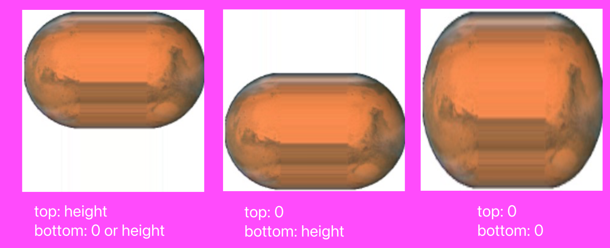

* [[languages.ios.swift]]
* [[languages.ios_book.views]]
    * languages.ios_book.views.drawing
    * [[languages.ios_book.views.layers]]
    * [[languages.ios_book.views.animation]]
    * [[languages.ios_book.views.touches]]
* [[languages.ios_book.interface]]
* [[languages.ios_book.frameworks]]
* [[languages.ios_book.useful]]

# Drawing

Many UIView subclasses, such as a UIButton or a UILabel, know how to draw themselves. 

A *pure UIView* is all about drawing, and it leaves that drawing largely up to you.

## Images and Image Views

图片可以来自文件，代码，或网络。

### Image Files
* `init(named:)`，会从`Asset catalog`和`App bundle`的顶层去查找
    * 返回的是一个Optional，因为不能确定这个路径对应一张图片，或能解码成功
    * 它会将图片缓存
        * `init(contentsOfFile:)`则不会缓存，但不从asset catalog加载而是相对于`Bundle.main`来做路径
* 从bundle里找时不加扩展名会默认为*png*
* 直接将图片拖到代码生成的不是Optional的image，调用的是`init(imageLiteralResourceName:)`方法
* 文件名里的@表示`High-resolution variants`，即不同分辨率下采用的图片，比如`@2x`
* 文件名里的~表示`Device type variants`，即不同设备类型下采用的图片，比如`~ipad`

> 尽量把图片放到asset catalog里，对不同的处理器，更宽的色域，等等
> 不光影响运行时，在Apple Store对你的app对特定设备进行*thinning*都会用到
> 不同size class, dark mode, ipad等等trait collection都可以设置对应的图片

**Vector images**

* An image file in the asset catalog can be a vector-based PDF or (new in Xcode 12) an SVG.
* `init(systemName:)` -> [SF Symbols](https://developer.apple.com/sf-symbols/)
    * `.withConfiguration(_:) or .applyingSymbolConfiguration(_:)` 进行自定义，参数是一个*UIImage.SymbolConfiguration*
    * Configurations can involve one of nine `weights`, one of three `scales`, a font or text `style`, and a `point size`, in various combinations


**Asset catalogs and trait collections**

指定trait collection初始化图片：`init(named:in:compatibleWith:)`
* A built-in interface object that displays an image, such as a UIImageView, is `automatically trait collection–aware`; 
* it receives the `traitCollectionDidChange(_:)` message and responds accordingly. 

```swift
let tcreg = UITraitCollection(verticalSizeClass: .regular)
let tccom = UITraitCollection(verticalSizeClass: .compact)
let moods = UIImageAsset()
let frowney = UIImage(named:"frowney")!
let smiley = UIImage(named:"smiley")!
moods.register(frowney, with: tcreg)
moods.register(smiley, with: tccom)
```
由此也可见，你操作的是“一张图片”，其实它是一**组**带了条件的图片。

> UIColor也是相同的机制，你用`resolvedColor(with:)`传入trait collection把对应的颜色取出来使用。

**Namespacing image files**

* 物理文件夹，虚拟文件夹内的图片访问时，都需要加上文件夹名（namespaing)
* `init(named:)`的完全形态其实是`init(named:in:)`，第二个参数是bundle，比如来自某个framework.

### Image Views

A UIImageView can actually have two images, one assigned to its `image` property and the other assigned to its `highlightedImage` property
A UIImageView without an image and without a background color is *invisible*

**Resizable Images**

用inset来设置**不**拉伸的区域，比如一般我们碰到的多为左右随便拉伸的胶囊按钮，需要设计师做的就是左右两个半圆（不拉伸）和中间1像素的可拉伸部分
```swift
let marsTiled = mars.resizableImage(withCapInsets:
UIEdgeInsets(
    top: mars.size.height / 2.0 - 1,
    left: mars.size.width / 2.0 - 1,
    bottom: mars.size.height / 2.0 - 1,
    right: mars.size.width / 2.0 - 1
), resizingMode: .stretch)
```
所以如果只是横向拉伸，上面的代码中，top, bottom都可以设为0，或都设为图片高度（而不去除2什么的），只需要保证把UI控件的高度保持跟图片一致即可。

那么，如果不小心高度大于图片高度了呢？分两种情况，如果设了0，表示没有保留区域，直接竖向拉伸，而如果设成了图片高度，那么表示整个Y方向没有可供拉伸的像素，必然造成拉伸失败：



**Transparency Masks**

The image shown on the screen is formed by combining the image’s `transparency` values with a single `tint color`.

忽略图片各像素上颜色的数值，只保留透明度，就成了一个mask. (renderingMode: `alwaysTemplate`)

* iOS gives every UIView a `tintColor`, which will be used to `tint any template images`。所以我们经常用的tintColor其实就是给模板图片染色的意思。
* tintColor是向下继承的
* The symbol images are always template images
* iOS 13起，可以对UIImage直接应用tint color

**Reversible Images**

* 用`imageFlippedForRightToLeftLayoutDirection`来创建一个在从右向左的书写系统里会自动翻转的图片。
    * 但你又可以设置`semanticContentAttribute`来阻止这个镜像行为
* 如果不考虑书写系统，可以用`withHorizontallyFlippedOrientation`强行镜像

## Graphics Contexts

Graphics Contexts是绘图的起点，你能从如下方式得到Graphics Contexts：
1. 进入UIView的 `draw(_:)`方法时，系统会给你提供一个Graphics Contexts
2. CALayer的`draw(in:)`,或其代理的`draw(_:in:)`方法，*in*参数就是Graphics Contexts
    * 但它不是`currnet context`
3. 手动创建一个

UIKit 和 Core Graphics是两套绘制工具。

* UIKit是大多数情况下你的选择，大部分Cocoa class知道如何绘制自己
* 只能在current context上绘制
* Core Graphics is the full drawing API， often referred to as `Quartz (2D)`
* UIKit drawing is built on top of it.

两套体系，三种context来源，共计6种殊途同归的方式。

### Drawing on Demand

直接上代码：

```swift
// UIView

// UIKit
override func draw(_ rect: CGRect) {
    // 直接绘制
    let p = UIBezierPath(ovalIn: CGRect(0,0,100,100))
    UIColor.blue.setFill()
    p.fill()
}

// CG
override func draw(_ rect: CGRect) {
    // 取到context
    let con = UIGraphicsGetCurrentContext()!
    con.addEllipse(in:CGRect(0,0,100,100))
    con.setFillColor(UIColor.blue.cgColor)
    con.fillPath()
}

// CALayer

// UIKit
 override func draw(_ layer: CALayer, in con: CGContext) {
    UIGraphicsPushContext(con)
    let p = UIBezierPath(ovalIn: CGRect(0,0,100,100))
    UIColor.blue.setFill()
p.fill()
    UIGraphicsPopContext()
}

// CG
override func draw(_ layer: CALayer, in con: CGContext) {
    con.addEllipse(in:CGRect(0,0,100,100))
    con.setFillColor(UIColor.blue.cgColor)
    con.fillPath()
}

### Drawing a UIImage

```swift
let r = UIGraphicsImageRenderer(size:CGSize(100,100))
let im = r.image { _ in
    let p = UIBezierPath(ovalIn: CGRect(0,0,100,100))
    UIColor.blue.setFill()
    p.fill()
}
// im is the blue circle image, do something with it here ...
And here’s the same thing using Core Graphics:
let r = UIGraphicsImageRenderer(size:CGSize(100,100))
let im = r.image { _ in
    let con = UIGraphicsGetCurrentContext()!
    con.addEllipse(in:CGRect(0,0,100,100))
    con.setFillColor(UIColor.blue.cgColor)
    con.fillPath()
}
// im is the blue circle image, do something with it here ...
```

## UIImage Drawing

用已有的图像进行绘制：
```swift
let mars = UIImage(named:"Mars")!
let sz = mars.size
let r = UIGraphicsImageRenderer(size:CGSize(sz.width*2, sz.height),
    format:mars.imageRendererFormat)
let im = r.image { _ in
    mars.draw(at:CGPoint(0,0))
    mars.draw(at:CGPoint(sz.width,0))
}
```
这里，绘制了两个火星，注意`imageRendererFormat`的使用

## CGImage Drawing

```swift
let mars = UIImage(named:"Mars")!
// extract each half as CGImage
let marsCG = mars.cgImage!
let sz = mars.size
let marsLeft = marsCG.cropping(to:
    CGRect(0,0,sz.width/2.0,sz.height))!
let marsRight = marsCG.cropping(to:
    CGRect(sz.width/2.0,0,sz.width/2.0,sz.height))!
let r = UIGraphicsImageRenderer(size: CGSize(sz.width*1.5, sz.height),
    format:mars.imageRendererFormat)
let im = r.image { ctx in
    let con = ctx.cgContext
    con.draw(marsLeft, in:
        CGRect(0,0,sz.width/2.0,sz.height))
    con.draw(marsRight, in:
        CGRect(sz.width,0,sz.width/2.0,sz.height))
}
```
当然, `con.draw`可以由UIImage来完成：
```swift
UIImage(cgImage: marsLeft!,
scale: mars.scale,
orientation: mars.imageOrientation).draw(at:CGPoint(0,0))
```

## Snapshots

* `drawHierarchy(in:afterScreenUpdates:)`将整个视图存成一张图片。
* 更快，语义更好的方法：`snapshotView(afterScreenUpdates:)` -> 输出是UIView，不是UIImage
